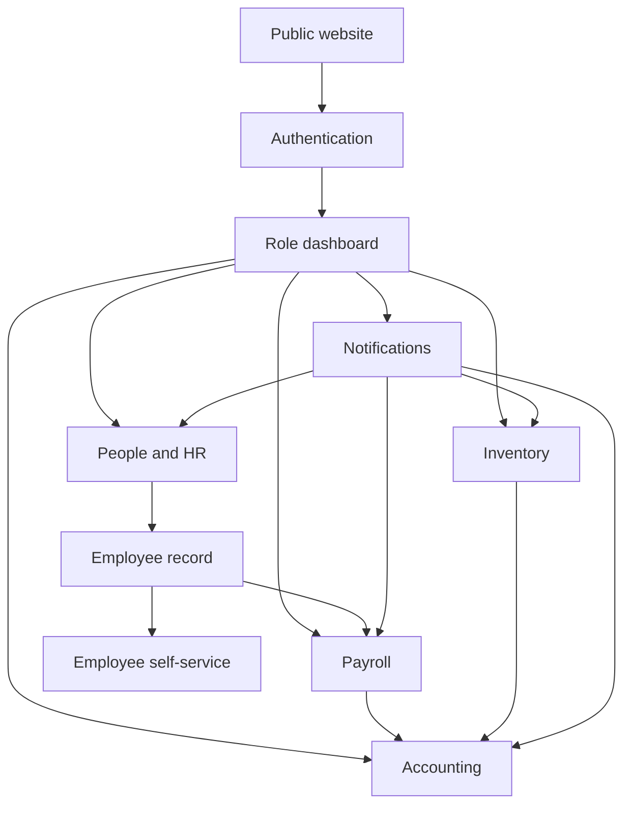
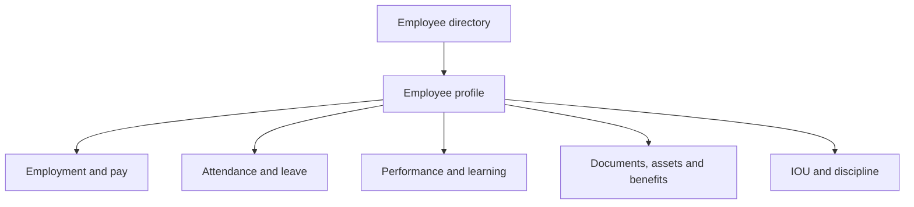
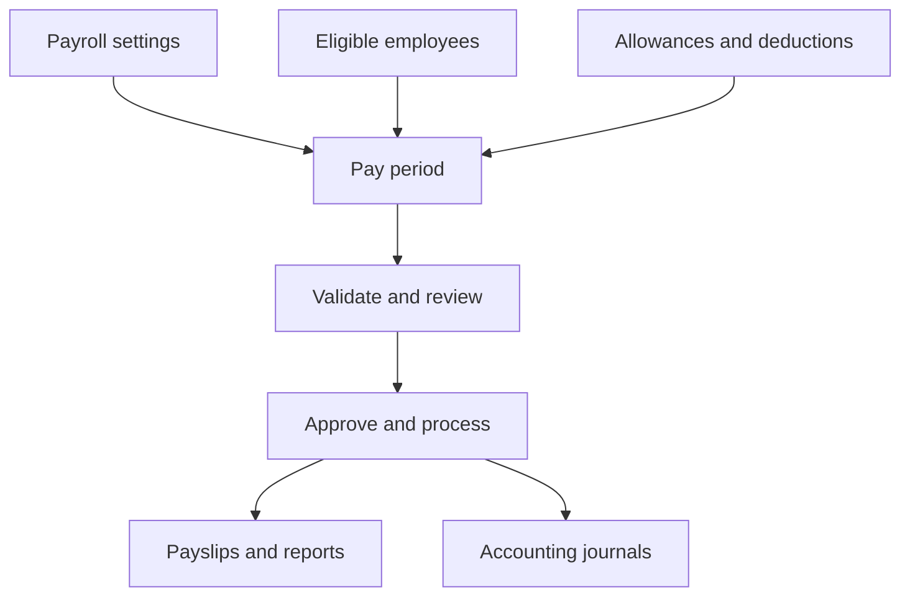
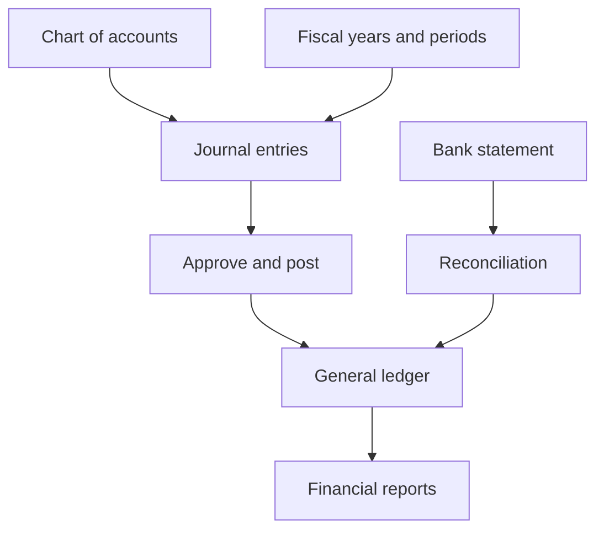
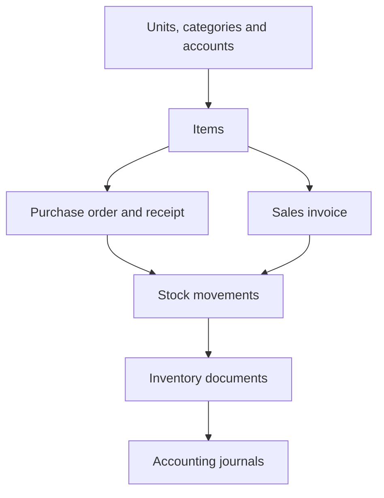

# PayNest Product Design System and Page Specification

**Repository:** `zayyadi/paroll`  
**Status:** Canonical UI/UX implementation brief  
**Audience:** UI/UX models, product designers, frontend engineers, and template maintainers  
**Scope:** All public, authentication, employee, HR, payroll, accounting, inventory, notification, settings, document, email, PDF, and error experiences

---

## 1. Purpose

This document is the single design source of truth for PayNest. It converts the existing routes, Django templates, layout shells, styling assets, and interaction conventions into one coherent system that can be implemented page by page without inventing a new visual language.

PayNest is a high-trust business application. Its interface must make payroll, HR, accounting, inventory, approvals, and compliance feel calm, legible, safe, and efficient. The product should look professional enough for finance teams and approachable enough for ordinary employees.

The target character is **Editorial Command**: clear hierarchy, generous but efficient spacing, restrained colour, strong typography, precise data presentation, and deliberate actions. Avoid generic admin-dashboard clutter, decorative gradients on every surface, excessive shadows, glass effects over data, tiny text, or ambiguous icon-only controls.

---

## 2. Repository UI Audit

The current repository contains 234 HTML templates and 290 application routes across the major URL modules:

| Area | Routes | Primary template area |
|---|---:|---|
| Payroll, HR, employee, reviews, IOU, notifications | 144 | `templates/employee`, `pay`, `payroll`, `iou`, `reviews`, `notifications` |
| Accounting | 77 | `templates/accounting` |
| Inventory | 32 | `templates/inventory` |
| Users and authentication | 17 | `templates/registration` |
| Discipline submodule | 11 | `templates/accounting/discipline` and employee discipline shell |
| Marketing | 9 | `templates/marketing` |

Template inheritance currently reflects multiple generations:

| Shell | Templates using it | Decision |
|---|---:|---|
| `base_new.html` | 85 | Canonical authenticated application shell |
| `accounting/base.html` | 55 | Keep as module shell, but inherit canonical components/tokens |
| `inventory/base.html` | 15 | Keep as module shell, but inherit canonical components/tokens |
| `base_tailwind.html` | 10 | Transitional; migrate to `base_new.html` |
| `base.html` | 6 | Legacy; migrate to `base_new.html` |
| `base_auth_new.html` | 8 | Canonical authentication shell |
| `base_auth.html` | 6 | Legacy; migrate to `base_auth_new.html` |
| `marketing/base.html` | 9 | Canonical public-site shell |

The repository mixes Bootstrap/MDB, generated Tailwind, runtime Tailwind configuration, inline styles, legacy CSS, and newer editorial templates. The newer system is already the most coherent: Inter body text, Manrope headlines, Lucide icons, teal primary colour, light neutral surfaces, rounded editorial panels, visible focus states, and responsive navigation. All redesign work must consolidate around that foundation.

### Canonical implementation hierarchy

1. `base_new.html` for every signed-in application page.
2. `accounting/base.html` and `inventory/base.html` only as navigation wrappers over `base_new.html`.
3. `base_auth_new.html` for login, registration, OTP, activation, password and account-recovery flows.
4. `marketing/base.html` for public pages.
5. `email/base_email.html` for email communication.
6. Purpose-built print/PDF shells for payslips, reports, payment slips, and allowance slips.

Do not extend `base.html`, `base_tailwind.html`, or `base_auth.html` in new work. Do not add another base shell.

---

## 3. Product Principles

### 3.1 Calm authority

Financial and employment data must feel stable. Use strong hierarchy, plain surfaces, consistent alignment, and concise language. Reserve bright colour for meaning and action.

### 3.2 One obvious next action

Every page must make the primary task immediately clear. A list page may use “Add employee”; a journal detail may use “Submit for approval”; a leave request may use “Approve”. Do not present several equally prominent buttons.

### 3.3 Data before decoration

Tables, balances, statuses, dates, approval history, and document identifiers are the product. Give them space and contrast. Decorative graphics must never reduce data density or obscure comparison.

### 3.4 Progressive disclosure

Show the common workflow first. Place advanced filters, audit metadata, posting configuration, reversal options, and destructive actions behind disclosure panels, overflow menus, or dedicated steps.

### 3.5 Role-aware, not role-confusing

Employee, manager, HR, payroll processor, accountant, auditor, and administrator experiences share one system but expose different navigation and actions. Never show disabled actions that a role can never use; hide them. When a temporarily unavailable action is relevant, show it disabled with a reason.

### 3.6 Nigerian business context

Default monetary presentation is Nigerian naira: `₦1,250,000.00`. Preserve currency metadata where multi-currency is supported. Use `DD MMM YYYY` for visible dates and an unambiguous date picker. Tax, pension, NHF, NHIS and PAYE language must remain exact.

### 3.7 Accessibility is structural

Design to WCAG 2.2 AA. Keyboard operation, focus visibility, colour contrast, semantic labels, error recovery, reduced motion, and responsive reflow are acceptance criteria—not polish tasks.

---

## 4. Brand and Visual Language

### 4.1 Brand position

PayNest is a dependable operations workspace, not a lifestyle brand. The visual identity should communicate:

- trust and control;
- modern Nigerian business competence;
- humane employee experience;
- precise financial operations;
- quiet confidence rather than corporate stiffness.

Use the configured `APP_NAME` and `APP_LOGO_URL` in product surfaces. Do not hard-code the product name where tenant branding is intended. “PayNest” is the default brand.

### 4.2 Colour tokens

The tokens already present in `base_new.html` are canonical.

| Token | Value | Use |
|---|---|---|
| `primary-50` | `#E7F6FA` | selected rows, subtle information backgrounds |
| `primary-100` | `#CDEAF2` | secondary highlight |
| `primary-500` | `#18667E` | charts, focus accents |
| `primary-600` | `#005C73` | primary buttons and selected navigation |
| `primary-800` | `#004355` | headings and strong brand text |
| `primary-900` | `#001F28` | maximum-emphasis text |
| `surface` | `#F9F9FA` | application canvas |
| `surface-low` | `#F3F4F4` | grouped regions and inputs |
| `surface-container` | `#EDEEEF` | secondary panels |
| `surface-high` | `#E7E8E9` | hover and stronger separation |
| `surface-lowest` | `#FFFFFF` | cards, sheets, menus |
| `on-surface` | `#1A1C1D` | primary text |
| `on-surface-variant` | `#40484C` | secondary text |
| `outline` | `#70787D` | control boundaries |
| `outline-variant` | `#BFC8CC` | subtle borders |
| `success-600` | `#1F7B48` | completed, approved, posted, paid |
| `warning-600` | `#C2410C` | pending attention, draft, due soon |
| `danger-600` | `#BA1A1A` | rejected, failed, overdue, destructive action |
| `tertiary` | `#5F3201` | restrained warm accent |
| `tertiary-fixed` | `#FFDCC2` | warm editorial highlight |

Rules:

- Use primary teal for brand and affirmative action, not for every heading, icon, and border simultaneously.
- Use semantic colours only for semantic meaning.
- Status badges use a pale background, dark text, and optional dot; never white text on a pale fill.
- Charts must remain understandable without colour. Add labels, patterns, or direct values.
- Body copy must meet 4.5:1 contrast; large text and non-text controls must meet 3:1.
- Dark mode may be implemented only as a complete token theme. Do not ship a partial colour inversion.

### 4.3 Typography

Use **Manrope** for display and section headings and **Inter** for interface, body, table, and numeric text. Use system fallbacks when web fonts fail.

| Style | Desktop | Mobile | Weight / line height |
|---|---:|---:|---|
| Display | 48 px | 36 px | 800 / 1.08 |
| Page title | 32 px | 28 px | 800 / 1.2 |
| Section title | 24 px | 22 px | 700 / 1.3 |
| Card title | 18 px | 18 px | 700 / 1.35 |
| Body | 16 px | 16 px | 400 / 1.55 |
| Compact UI/table | 14 px | 14 px | 400–600 / 1.45 |
| Supporting text | 13 px | 13 px | 400–600 / 1.4 |
| Eyebrow | 11 px | 11 px | 700 / 1.3, uppercase, 0.16em tracking |

Use tabular numerals for money, payroll values, report columns, counts and timestamps. Right-align numeric table columns. Avoid body copy below 13 px and avoid letter-spaced uppercase text longer than three words.

### 4.4 Spacing and grid

Use a 4 px base unit with this practical scale: 4, 8, 12, 16, 20, 24, 32, 40, 48, 64.

- Application content maximum: 1440 px.
- Marketing content maximum: 1280 px; reading text maximum: 720 px.
- Desktop page gutters: 32–40 px.
- Tablet gutters: 24 px.
- Mobile gutters: 16 px.
- Standard section gap: 32 px desktop, 24 px mobile.
- Standard card padding: 24 px desktop, 20 px mobile.
- Dense table cell padding: 12 px vertical and 16 px horizontal.

Use a 12-column desktop grid, 8-column tablet grid, and 4-column mobile grid. KPI cards may form four, two, then one column. Forms default to a maximum readable width of 800 px rather than stretching edge to edge.

### 4.5 Shape, border, and elevation

- Small controls/badges: 8–10 px radius.
- Inputs/buttons: 12–14 px radius.
- Cards: 16–20 px radius.
- Major editorial/marketing panels: 24–32 px radius.
- Default border: 1 px `outline-variant` at 30–45% opacity.
- Default cards use border separation, not shadow.
- Floating menus, dialogs, sticky action bars and popovers may use `0 8px 24px rgba(26,28,29,.10)`.
- Do not nest more than two visibly rounded containers.

### 4.6 Iconography and imagery

Use Lucide exclusively for application icons. Default sizes are 16 px inline, 20 px controls, and 24 px feature/navigation icons. Every icon-only button requires an accessible name and tooltip. Avoid mixing Font Awesome and Lucide on redesigned pages.

Photography is appropriate for public marketing, employee avatars, and culture content. Use authentic workplace imagery and inclusive Nigerian/African representation. Do not use stock imagery inside operational dashboards. Empty states may use restrained line illustrations only when they help comprehension.

---

## 5. Application Shell and Navigation

### 5.1 Desktop shell

The signed-in shell contains:

1. A skip link.
2. A fixed or sticky left sidebar, 264 px expanded and 80 px collapsed.
3. A top utility bar, 64–72 px high.
4. A responsive content canvas.
5. A mobile navigation drawer.

Sidebar order:

- tenant/product identity and company switcher;
- role-appropriate primary navigation;
- grouped module navigation;
- help/support;
- user identity and account menu.

The top bar contains the mobile menu trigger, current context, global search/command entry if implemented, notifications, and user/company utilities. Avoid duplicating full navigation in both sidebar and top bar.

### 5.2 Information architecture

Use this primary module order for privileged users:

1. Overview
2. People & HR
3. Payroll
4. Accounting
5. Inventory
6. Reports
7. Notifications
8. Company settings

Employee self-service navigation should prioritize:

1. Home
2. My pay
3. Time & leave
4. Documents
5. Performance & learning
6. Benefits & assets
7. Requests/IOU
8. Profile

Do not place all 144 payroll/HR routes directly in the sidebar. Sidebar groups open to no more than 5–7 visible children. Less frequent destinations belong on module overview pages.

### 5.3 Page header

Every application page begins with a consistent header:

- breadcrumb on complex nested pages;
- one H1 page title;
- one sentence of supporting context when useful;
- primary action at the right on desktop and below the title on mobile;
- secondary actions in an overflow menu;
- optional compact metadata or status below the title.

Do not repeat the same title in the shell, card, and table.

### 5.4 Responsive behaviour

- Below 1024 px, collapse module side navigation into a drawer or horizontal section selector.
- Below 768 px, stack page header actions and KPI cards.
- Tables preserve critical columns and move secondary fields into an expandable row/card detail; do not simply shrink text.
- Primary mobile actions may use a sticky bottom action bar, respecting safe areas.
- Touch targets must be at least 44 × 44 px.

---

## 6. Core Components

### 6.1 Buttons

| Variant | Use |
|---|---|
| Primary | Single dominant page action |
| Secondary | Important alternative action |
| Tertiary/ghost | Low-emphasis action in toolbars/cards |
| Destructive | Delete, reject, void, reverse after confirmation |
| Text link | Navigation or inline contextual action |

Buttons use action-first labels: “Create employee”, “Save draft”, “Submit for approval”, “Download PDF”. Avoid “Yes”, “OK”, “Submit”, or icon-only primary actions. Show a spinner and retain the label during submission. Prevent duplicate submission. Disabled buttons require a visible explanation when the reason is not obvious.

### 6.2 Form controls

All fields require persistent labels. Placeholder text is an example or hint, never the only label. Provide help text before errors. Validate on blur for format and after submission for business rules; do not interrupt typing.

- Control height: 44–48 px.
- Textarea minimum: 120 px.
- Required fields use “Required” in accessible helper text; do not depend on an asterisk alone.
- Prefix currency controls with `₦` visually and expose the currency to assistive technology.
- Use search-select only when choices are numerous.
- Dates use typed input plus picker and an explicit format hint.
- File upload shows accepted formats, size limit, selected file, progress and replacement/removal action.
- Multi-step payroll, journal, opening-stock and import workflows use a stepper with saved progress.

At the top of a failed form, show an error summary linking to invalid fields. Inline errors appear directly below the control and include correction guidance.

### 6.3 Cards and KPI tiles

Cards contain one conceptual group. A KPI tile includes label, value, comparison or context, and optional semantic trend. Do not use an icon as the primary content. Financial KPI tiles must state the period and currency.

### 6.4 Tables and lists

Operational tables share a standard structure:

- title/count and optional description;
- search, filter button and saved-view controls;
- active filter chips and “Clear all”;
- bulk selection/actions where appropriate;
- sticky header for long tables;
- sortable headers with accessible sort state;
- right-aligned tabular numeric values;
- status badges;
- row click for detail plus an explicit overflow menu;
- pagination and rows-per-page control;
- empty, loading and error states.

Do not hide core actions behind row hover. Do not use alternating zebra stripes and heavy grid borders together. Prefer subtle row dividers and a selected-row tint.

### 6.5 Status badges

Keep terminology domain-specific and consistent:

- Draft, Pending, Submitted, In review: neutral/warning.
- Approved, Active, Posted, Paid, Reconciled, Completed: success.
- Rejected, Failed, Overdue, Cancelled, Voided: danger.
- Reversed, Archived, Inactive: neutral.

Badge text must be sufficient without colour. Never create multiple labels for the same state.

### 6.6 Alerts, toast and banners

- Inline alert: persistent information affecting the current task.
- Banner: system-wide or module-wide condition.
- Toast: confirmation of a completed, reversible, low-risk action.
- Modal alert: only for an action requiring immediate confirmation.

Success toasts disappear after 5–7 seconds and may offer Undo. Error messages remain until dismissed or resolved.

### 6.7 Dialogs and destructive actions

Use dialogs for compact decisions, not long forms. A destructive confirmation states the object, consequence, and recovery status. High-risk actions such as posting, reversing, closing a period, deleting payroll data, or rejecting a request require a dedicated confirmation step; typed confirmation is reserved for irreversible batch actions.

### 6.8 Empty, loading, and error states

Every data surface needs:

- first-use empty state with a primary setup action;
- no-results state that preserves filters and offers reset;
- skeleton loading shaped like the final content;
- inline retry for recoverable failures;
- permission state explaining what is unavailable and whom to contact.

Do not display an empty table with only “No data”.

### 6.9 Charts

Use charts only when trend or comparison is faster to understand visually. Pair every chart with exact values or an accessible data table. Recommended patterns:

- line: payroll/account balances over time;
- grouped bar: gross pay, deductions, net pay by period;
- horizontal bar: department or category comparison;
- donut: only for 2–5 parts of a whole;
- sparkline: compact KPI context.

Start quantitative axes at zero unless a clearly labelled analytical reason requires otherwise. Avoid 3D charts.

---

## 7. Page Archetypes

Every route should map to one of these patterns.

### A. Dashboard

Page header → period/context controls → 3–5 KPI cards → primary trend/summary → action queue → recent activity → module shortcuts. Prioritize exceptions and decisions over vanity metrics.

### B. List/index

Page header + create action → search/filter toolbar → active filters → table/list → pagination. Bulk actions appear only after selection.

### C. Detail/record

Breadcrumb → title, identifier, status and key actions → summary strip → tabbed or sectioned detail → related records → audit/activity timeline. The first viewport must answer “what is this, what state is it in, and what can I do?”

### D. Create/edit form

Header → optional stepper → grouped form sections → contextual help → sticky footer with Cancel and Save/Continue. Preserve entered data after validation errors.

### E. Approval/review

Record summary → submitted evidence/changes → policy or balance checks → comments/history → reject/request changes/approve action bar. Approval actions must clearly state their effect.

### F. Report

Title and period → filter controls → generation status → summary figures → table/chart → export menu → methodology/data freshness note. Print/PDF output is visually simpler than the screen version.

### G. Settings

Settings category navigation → narrow form sections → autosave only for reversible preferences → explicit Save for financial/security configuration → audit note for sensitive changes.

### H. Public/content page

Marketing header → clear proposition or title → readable structured sections → relevant CTA → trust/security proof → footer. Legal pages use a reading layout and table of contents.

---

## 8. Page-by-Page Design Specification

### 8.1 Public marketing routes

| Route/page | Required design |
|---|---|
| Marketing landing | Focused hero with payroll/HR value proposition, two CTAs, product proof, feature workflow, compliance/trust block, testimonial/customer proof when real, pricing preview and final CTA. Avoid a collage of disconnected cards. |
| Pricing | Monthly/annual toggle if supported, 2–4 comparable plans, highlighted recommended plan, precise included limits, implementation/support notes, FAQ and demo CTA. Never hide critical pricing conditions. |
| About | Mission, audience, operating principles, company story and real team/trust information. Keep prose within 720 px. |
| Support | Search-first help gateway, task-based categories, common answers, support channels, response expectations and system status link if available. |
| Security | Security model, access control, data protection, backups, audit logging, incident/contact process and factual compliance claims only. |
| Contact | Short qualification form, direct contact alternatives, expected response time, privacy note and success confirmation. |
| Privacy, terms, cookies | Persistent title/date/version, in-page table of contents, readable typography, anchored sections and print support. |

Public navigation must work on mobile with an accessible menu. Always provide Sign in and a single primary Start trial/Book demo CTA. The current “Editorial Command” visual language may remain, but product copy must be direct rather than decorative.

### 8.2 Authentication and account routes

Login, registration, social login, activation, OTP verification, password reset, password change, logged-out confirmation and account settings use `base_auth_new.html`.

- Use a centred 440–520 px authentication card on a calm branded background.
- Show logo/product identity, task title, concise guidance, form, alternate route, and security reassurance.
- Password fields include show/hide, requirements, Caps Lock feedback, and password-manager-friendly attributes.
- OTP uses six accessible single-character boxes or one segmented input, supports paste, states destination, expiry, resend countdown and change-address action.
- Registration groups personal identity, company details and password logically; show terms consent without preselection.
- Password reset never reveal whether an email exists; provide a neutral confirmation.
- Company switching shows company name, logo/initial, role and current indicator in a searchable menu—not a bare select.
- Settings use application shell after authentication; security settings separate password, MFA, sessions and notification preferences.

### 8.3 Role dashboards

| Page | Priority content |
|---|---|
| Root/app routing | Route signed-in users to the correct role dashboard; signed-out users to public landing/login. Avoid an ambiguous intermediate home. |
| Admin dashboard | Workforce, payroll status, approval queues, compliance deadlines, recent changes and system setup completeness. |
| Employee dashboard | Next payday, latest net pay, leave balance, clock status, pending requests, documents needing acknowledgement, assigned learning/reviews and announcements. |
| HR dashboard | Headcount, attendance/absence, onboarding/hiring, leave/action queues, appraisal progress, documents and emerging exceptions. |
| Payroll dashboard | Current pay period, readiness checklist, employee coverage, gross/deduction/net summary, exceptions, processing action and previous runs. |
| Accounting dashboard | Cash/account snapshots, unposted journals, open periods, reconciliation state, approval queue, close checklist and reports. |
| Inventory dashboard | Stock value, low/out-of-stock items, pending receipts/orders, movement trend, posting exceptions and fast operational actions. |
| Standup dashboard | Today’s participation, unresolved blockers, team summaries and date navigation; keep it visually separate from financial KPIs. |

### 8.4 People, employee profiles and HR operations

**Employee list:** searchable/filterable directory with employee identity, ID, department, job title, status, manager and employment date. Support table and visual directory views only if both are useful. Primary action is Add employee. Import/export are secondary.

**Add/update employee:** multi-section form for identity, employment, organization, compensation/payroll, bank/tax/pension, emergency contact, permissions and documents. Sensitive compensation fields must be permission-protected and visually marked. Use Save draft where onboarding is incomplete.

**Employee profile/detail:** identity header, employment status and role-aware actions followed by Overview, Job, Compensation, Leave & attendance, Documents, Performance, Assets/benefits and Activity tabs. Keep audit metadata out of the overview.

**Self profile:** editable personal/contact/bank fields with verification status and clear separation from employer-controlled fields. Data export is a secondary privacy action.

**Documents:** employee view emphasizes required acknowledgement and expiry; overview view emphasizes missing, expired and unacknowledged documents. Use file type, owner, visibility, upload date, expiry and status consistently.

**Assets:** self view shows assigned assets and return workflow; overview shows owner, condition, issued date, due/returned date and exceptions. Return action requires condition and confirmation.

**Benefits:** self view shows eligibility, enrollment, employer contribution and coverage dates; overview shows participation and pending changes. Enroll flows disclose effective date and deductions before confirmation.

**Learning:** self view shows assigned/in-progress/completed courses; overview shows completion and overdue assignments. Progress must be numeric and textual, not colour alone.

**Surveys:** show purpose, anonymity status, estimated time, close date and progress. Admin overview shows response rate and results only when privacy thresholds permit.

**Performance:** self view focuses goals, reviews, one-on-ones and feedback; manager overview focuses due actions, distribution and follow-up. Avoid ranking people without explicit policy support.

**Workflows:** visual status board for active onboarding/offboarding/business workflows with owner, current step, due date and blockers. Provide list view for accessibility and scale.

### 8.5 Attendance and leave

**My day:** large current clock state, local time, Clock in/out primary action, today’s events, total worked, breaks and correction link. Confirm location/device requirements before action.

**Attendance overview:** period filter, attendance KPIs, exceptions queue, team table and trend. Late/absent statuses must include policy context.

**Who is out:** calendar/list toggle, today/upcoming groups, leave type where permitted, team filter and privacy-aware descriptions.

**Apply/edit leave:** balance summary before fields, leave type, dates or partial day, calculated duration, approver, reason/attachment and policy impact. Warn before dates that exceed balance or conflict with policy.

**Leave requests:** employee list uses status timeline and next action. Manager list prioritizes pending requests and staffing overlap. Approve/reject are explicit and rejection requires a reason.

**Leave calendar:** month/week views, team filters, accessible list alternative, compact legend and overlap indicators.

**Leave policies:** policy cards/table with eligibility, allowance, carryover, notice and documentation. Editing is a dedicated settings flow.

**Leave allowance slip:** formal document layout with employee, period, calculation, approval and print/download actions.

### 8.6 Hiring workspace

Use a pipeline view for requisitions and candidates with an accessible list alternative. Requisitions show role, department, owner, openings and state. Candidate detail contains profile, stage timeline, scorecards, interviews/documents and activity. Advancing a candidate confirms the new stage. Offer creation previews all terms; acceptance state is explicit and immutable in history.

### 8.7 Payroll setup and processing

**Payroll settings:** grouped organization, schedule, statutory, calculation, approval, payslip and bank settings. Show setup completeness and last modified identity/time. Sensitive changes use confirmation and audit history.

**Pay periods:** list displays period, status, employee count, gross, deductions, net, processor and payday. Create flow uses dates, scope, variable input/import, validation preview, calculation review and confirmation.

**Pay variables:** searchable employee selection, variable type, amount/rate, effective period and bulk import. Show validation results before commit and clearly distinguish allowances from deductions.

**Allowances/deductions:** structured forms with calculation type, taxable/pensionable flags, recurrence, effective dates, limits and affected employees.

**Payroll run/add pay:** readiness checklist first; blockers separated from warnings. Use a staged workflow: Scope → Inputs → Validate → Review totals → Approve/process → Complete. Once posted, replace editing controls with correction/reversal workflow.

**Payslip list:** period selector, employee, status, gross, deductions, net, delivery status and download/send actions. Protect bulk delivery with confirmation.

**Payslip detail:** employee/company header, earnings table, deductions table, employer contributions, totals, YTD summary, payment/bank reference and download. Net pay is the dominant figure. PDF mirrors the data, not the application chrome.

**Statutory and bank reports:** bank, pension, PAYE, NHF and NHIS list pages show period, status, total, employee/record count, generated time and download. Detail pages use exact columns, totals, validation warnings and export metadata.

### 8.8 IOU and employee advances

**Request IOU:** state requested amount, purpose, proposed repayment, outstanding exposure and policy before submission.

**My tracker/history:** summary of outstanding, repaid and next deduction; chronological table/timeline with status and balance after transaction.

**Admin list/detail:** prioritize pending approvals and overdue balances. Detail includes request, employee context, repayment schedule, deductions/payments, documents, comments and audit history.

**Approve/update/delete:** approval previews payroll impact; rejection requires reason; update shows what changes; delete is permitted only where business rules allow and clearly states consequences.

**Payment slip:** print-ready receipt with unique reference, payer, amount, balance, method, date and authorization.

### 8.9 Appraisals and reviews

Appraisal list displays cycle, population, progress, due date and status. Creation uses Basics → Questions/criteria → Participants → Schedule → Review. Assignment provides searchable employee selection and exclusions. Appraisal detail shows progress and incomplete actions before aggregate results. Review form saves drafts, communicates scale anchors and completion. Delete actions disclose whether submitted reviews exist.

### 8.10 Discipline

Discipline is an HR workflow, even where legacy templates reside under accounting. Use a restrained, confidential design.

- System page: caseload summary, state distribution, due actions and policy links.
- Case list: reference, employee, category, severity, owner, state and next deadline.
- Case detail: confidential banner, allegations/summary, parties, evidence, investigation timeline, decision, sanction, appeal and immutable activity log.
- Create/edit: structured allegation, policy, dates, parties, confidentiality and attachments.
- Evidence: source, type, collected date, description, file and chain-of-custody metadata where needed.
- Decision/sanction: show evidence summary and policy basis before outcome.
- Appeal/review: separate original decision from appeal grounds and reviewer outcome.

Never expose disciplinary information through general employee lists, global previews or notifications beyond the minimum necessary.

### 8.11 Notifications

**Dropdown:** maximum 5–7 recent items, unread emphasis, concise category icon, timestamp, mark-read behaviour and “View all”.

**List:** tabs for All/Unread and meaningful categories, date grouping, bulk mark read/delete, search/filter when scale requires it.

**Detail:** source context, full message, related-record CTA, timestamp and read state. Preserve safe back navigation.

**Aggregated/digests:** grouped by source/event with count and expandable child items; daily/weekly digest settings state delivery time and timezone.

**Preferences:** master channel controls followed by per-category email/in-app choices. Critical security notifications cannot be disabled and must explain why.

### 8.12 Accounting

Accounting retains its module shell but must use the same global tokens/components. Its current left-side menu is too long for routine use; group it into Overview, Accounts, Journals, Periods, Reconciliation, Reports and Audit, with module landing shortcuts for secondary destinations.

**Chart of accounts:** hierarchical table/tree with code, name, type, normal balance, parent, current balance and status. Search must reveal ancestor context. Create/edit forms show account behaviour and posting implications.

**Account detail/activity:** identity and balance summary, period filters, debit/credit movement, related entries and export. Running balance must be clearly labelled.

**Opening balances/import:** downloadable template, drag/drop upload, mapping, row validation, reconciliation total and commit confirmation. Keep an import result record.

**Journals:** list prioritizes status and balance. Form uses header information plus an editable line-item table with account search, description, debit and credit. Keep totals sticky and prevent submission until debits equal credits. Detail shows lifecycle timeline and posting/audit metadata.

**Journal approval/post/reversal:** dedicated review states. Show original entry, consequence, permissions and required reason. Partial/corrective reversal clearly distinguishes original, reversal and replacement journal. Batch reversal provides preview and failure handling.

**Fiscal years/periods:** list/detail surfaces show state, dates and close readiness. Closing uses a checklist of unposted items, reconciliations, inventory/payroll integration and confirmation. Closed-period changes require an explicit governed workflow.

**Reconciliation:** list shows account, statement period, matched/unmatched totals and state. Create/import uses statement source and opening/closing balances. Matching uses a two-pane or grouped candidate interface with amounts/dates/references and confidence cues, while keeping manual control. Approval summarizes remaining differences.

**Audit trail:** immutable chronological table with actor, action, object, timestamp, company, before/after indicator and source. Detail renders structured diffs; never colour alone. Filters are prominent and exports are permission-gated.

**Report index:** categorized report cards: Core statements, Ledger, Receivables/payables, Performance, Inventory, Close and Custom reports. Each card states purpose and required period.

**Financial reports:** trial balance, general ledger, balance sheet, income statement, cash flow, account balances/activity, AR/AP aging, inventory turnover, gross margin and financial ratios share one report shell with period controls, comparison, generation timestamp, exact tables, notes and export.

**Executive dashboard:** concise financial story: cash/liquidity, revenue/profit, receivables/payables, inventory, trends and exceptions. Every visual links to its underlying report.

**Month-end checklist:** ordered tasks with owner, dependency, status, due date and evidence. Overall close status cannot imply completion while blockers remain.

**Report designer:** list, form and line editor use a clear hierarchy preview. Provide reorder controls that work with keyboard, validation, preview and version/audit metadata.

**Async reports/jobs:** show queued/running/completed/failed states, progress where real, requested parameters, owner, expiry and download/retry. Never display fake percentage progress.

**MFA verification:** use a focused security interstitial explaining the sensitive action, verification method and safe cancellation path.

### 8.13 Inventory

The inventory module shell should group its long menu into Overview, Catalogue, Partners, Purchasing/Sales, Stock operations, Payments/Tax, and Ledger.

**Items/categories/units:** item list shows SKU, name, category, unit, on-hand, available, reorder state, cost/value and status. Item detail adds warehouse/location balances, movement timeline, purchasing/sales history and accounting setup.

**Warehouses/locations:** list or hierarchy with status, item count and stock value. Creation clarifies parent relationship and operational constraints.

**Suppliers/customers:** list provides name, code, contact, balance, recent activity and status. Detail provides financial summary, documents/orders/invoices/payments and activity.

**Purchase orders:** list includes number, supplier, date, expected date, total, received progress and status. Create uses line items, tax/discount, totals and approval. Receiving compares ordered, previously received and current receipt quantities.

**Movements/documents:** immutable operational ledger with document/reference, item, warehouse/location, quantity in/out, value, actor and timestamp. Detail links to source document.

**Opening stock, receipts, invoices, returns, payments, remittances, adjustments and transfers:** use the transaction form pattern: Header → Parties/locations → Line items → Totals/reason → Accounting preview → Validate → Post. Once posted, show a receipt/detail state rather than leaving an editable form.

**Posting account setup:** mapping table with transaction/category, debit account, credit account, effective state and validation. Missing mappings appear as blockers on related transactions.

**Approval workflows:** list shows operation, amount/value, requester, approver, age and status. Detail follows the shared approval archetype.

### 8.14 Settings and company context

Settings should be organized into Profile, Company, Team & roles, Payroll, Accounting, Inventory, Notifications, Security, Integrations and Audit. Use a settings side navigation on desktop and section selector on mobile. Display tenant/company context persistently for changes. Sensitive changes show last modified identity/time and require explicit Save.

### 8.15 Error pages

400, 403, 404 and 500 pages use a lightweight branded shell with:

- plain-language title;
- brief explanation without stack details;
- primary route back to a safe dashboard/home;
- secondary retry or support route where appropriate;
- request/reference ID for 500 errors when available.

403 must distinguish missing permission from authentication expiry. 404 should offer search only if global search is functional.

### 8.16 Email templates

Use a 600 px responsive email frame, logo, clear title, concise content, one primary CTA, plain URL fallback, reason-for-email footer and support/security note. Payroll/payslip and OTP emails must not expose unnecessary sensitive values in subject lines or previews. Status colours are secondary to explicit text. Provide robust plain-text alternatives.

### 8.17 PDF and print templates

Payslip, statutory reports, accounting reports, IOU payment slips and leave allowance slips use A4-aware print layouts with 12–15 mm margins, black/dark text, minimal colour, repeated table headers, protected row breaks, page number, generation timestamp and document reference. Application navigation and interactive controls never print. Numeric columns align by decimal/place value. Provide “Confidential” treatment where appropriate.

---

## 9. Content Design

### Voice

Use direct, respectful, specific language. Prefer “Your leave request was approved” to “Success!”. Prefer “This journal cannot be posted because debits and credits differ by ₦25,000” to “Invalid journal”.

### Labels

- Navigation uses nouns: Employees, Pay periods, Journals.
- Actions use verbs: Add employee, Run payroll, Post journal.
- Confirmation titles name the consequence: “Reverse journal JE-0042?”
- Table headers are concise and unambiguous.
- Dates and amounts include context where needed.

### Help and errors

Explain business consequences close to the action. Errors must state what happened, why when known, and how to recover. Never blame the user. Do not expose internal exceptions or database language.

### Empty-state example

**No pay period yet**  
Create a pay period to collect payroll inputs and calculate employee pay.  
`Create pay period`

---

## 10. Interaction and Motion

- Default transition duration: 150–200 ms.
- Page/section entrance: maximum 300 ms and only when it aids orientation.
- Hover lift is limited to interactive marketing or shortcut cards; data cards remain stable.
- Dialogs fade/scale subtly; drawers slide from their physical edge.
- Respect `prefers-reduced-motion` and remove nonessential movement.
- Never animate numeric financial values in a way that delays reading.
- Preserve scroll position when closing a detail drawer or returning from a record.
- Use optimistic updates only for reversible, low-risk actions such as marking notifications read—not payroll, journal, approval, or posting actions.

---

## 11. Accessibility Requirements

Every implementation must satisfy the following:

- one logical H1 per page and properly nested headings;
- semantic landmarks: header, nav, main, aside, footer;
- skip link to main content;
- visible 3 px focus ring consistent with `base_new.html`;
- full keyboard access with logical focus order;
- focus moves to dialog and returns to trigger on close;
- form inputs have programmatic labels, help and error association;
- tables use captions or nearby headings and correct header scope;
- sort state, expanded state, selected state and live updates are announced;
- status and chart meaning is not conveyed by colour alone;
- images have purposeful alt text; decorative images use empty alt;
- minimum 200% text zoom and 400% reflow without loss of function;
- touch target minimum 44 × 44 px;
- errors are summarized and focusable;
- authentication supports password managers and paste;
- timeouts and session expiry warn users and preserve safe draft data where possible.

---

## 12. Implementation Rules for a UI/UX Model

When redesigning any page:

1. Identify its route, role, business object, state transitions and existing Django context variables.
2. Assign the page to one archetype in Section 7.
3. Preserve Django URL names, template variables, permission checks, CSRF handling, POST semantics and business logic.
4. Extend the canonical shell. Do not create a standalone document unless it is marketing, auth, email, PDF or an error page.
5. Compose from shared components instead of writing page-specific versions of buttons, alerts, cards, badges, tables and pagination.
6. Include default, loading, empty, no-result, validation-error, server-error, success, permission and disabled states.
7. Design desktop, tablet and mobile layouts together.
8. Use Lucide icons with labels; never use emoji as application icons.
9. Use canonical tokens—no arbitrary hex values or one-off shadows in page templates.
10. Keep financial and approval actions server-confirmed. Provide pending state and idempotent submission behaviour.
11. Make filters query-string driven so views are linkable and restorable where technically possible.
12. Preserve print and screen separation for reports/documents.
13. Never fabricate metrics, testimonials, compliance claims, activity, or chart data.

### Required page handoff output

For each redesigned page, the model must provide:

- page purpose and primary user;
- information hierarchy;
- desktop and mobile structure;
- components and variants used;
- data fields and formatting;
- actions and permissions;
- all relevant states;
- interaction notes;
- accessibility notes;
- mapping to existing template and named route;
- reusable partials/components created or changed.

---

## 13. Required Screen Inventory, Relationships, Data and Fields

This section is prescriptive. A UI/UX model must design every screen listed below. Routes that only perform an action—approve, reject, acknowledge, mark read, clock, post, download or delete—do not need an unrelated standalone page; they need a confirmation, progress and result state inside the parent workflow.

### 13.1 Product-wide relationship map



The global company switcher scopes every authenticated page. Employee identity is the shared record connecting HR, payroll, attendance, leave, IOU, appraisal, discipline, documents, assets, benefits, learning and surveys. Posted payroll and inventory transactions feed accounting. Notifications deep-link to the exact related record, not merely to a module dashboard.

### 13.2 Date, time, money and identity fields

Use these rules on every relevant page:

| Data type | Display | Input and behaviour |
|---|---|---|
| Date | `02 Aug 2026` | Native/accessible picker plus typed `DD/MM/YYYY`; store ISO date |
| Month/period | `August 2026` | Month and year selector; never a free-text month |
| Date range | `01–31 Aug 2026` | Start and end fields; validate end ≥ start |
| Time | `14:35` | 24-hour time by default; show timezone when cross-zone relevance exists |
| Date and time | `02 Aug 2026, 14:35 WAT` | Store timezone-aware timestamp; relative time may supplement, never replace |
| Money | `₦1,250,000.00` | Currency-aware numeric input, no negative value unless the transaction permits it |
| Percentage | `7.50%` | Numeric input with `%` suffix and explicit bounds |
| Quantity | `1,250.0000 kg` | Respect unit precision; show unit beside value |
| Person | Avatar/initial, full name, employee ID | Search by name, email or employee ID |
| Record identity | Human-readable reference such as `JE-0042` | Show reference consistently in title, URL context, confirmation and audit trail |
| Audit timestamp | Exact timestamp plus actor | Immutable and company-scoped |

Every detail page must expose `created_at`, `updated_at`, status and responsible actor in an Activity/Audit section when those fields exist. Do not clutter the primary summary with system timestamps.

### 13.3 Public website and authentication screens

| Screen | Relationship and destinations | Required data and fields |
|---|---|---|
| Landing | Entry to Pricing, About, Security, Support, Contact, Register and Login | Product name/logo; headline; description; primary/secondary CTA; verified product capabilities; trust evidence; feature names/descriptions; testimonial/customer data only if real |
| Pricing | Landing → plan selection → Register/Contact | Billing frequency; plan name; price/currency; billing interval; employee/user limit; feature list; exclusions; trial details; CTA; FAQ |
| About | Public navigation → Contact/Register | Mission; story; values; audience; team/company facts; CTA |
| Support | Public/app help → Contact | Search query; help categories; article title/summary/link; support channel; availability; expected response time |
| Security | Public navigation → Contact | Security control category; description; data/backup/access/audit facts; disclosure contact; last reviewed date |
| Contact | Public navigation → success state | Full name; work email; phone optional; company; employee count optional; topic; message; consent; submitted timestamp/reference |
| Legal pages | Footer → privacy/terms/cookies | Document title; effective date; last updated date; version; table of contents; sections; contact |
| Login | Public/Register/Reset → role dashboard | Email; password; remember session; show password; forgot password; SSO choices when configured; error; safe return path |
| Register | Public/Login → OTP/activation → dashboard | First name; last name; work email; company name; password; password confirmation; terms/privacy consent; optional invitation code |
| OTP/activation | Register/reset/security action → success destination | Masked destination; six-digit code; expiry timestamp/countdown; resend; change address; attempt/error state |
| Password reset | Login → reset email → confirm → Login | Email; new password; confirmation; password rules; token validity; completion state |
| Password change | Settings → re-auth/completion | Current password; new password; confirmation; session-revocation option |
| Company switcher | Any app page → same logical page in new company or company dashboard | Company logo/initial; company name; user role; current/default indicator; search; switch progress/error |

### 13.4 Dashboards and module entry screens

| Screen | Relationship and destinations | Required data and fields |
|---|---|---|
| Employee dashboard | Auth → self-service pages | Greeting/name; company; current clock status; next payday/date; latest net pay/period; leave balances; pending request counts; documents awaiting acknowledgement; learning/review due dates; announcements |
| Admin dashboard | Auth → all modules/settings | Company; reporting period; employee count/status; payroll readiness/status; approval counts; accounting exceptions; inventory exceptions; compliance deadlines; setup completion; recent activity |
| HR dashboard | App → employees, attendance, leave, hiring, appraisal, discipline | Date/period; headcount; new hires/exits; attendance/absence; pending leave; hiring pipeline; overdue appraisals; open cases; expiring documents; task owner/due date |
| Payroll dashboard | App → pay period/run, variables, payslips, reports | Current period; start/end/pay date; payroll status; employee coverage; gross; deductions; net; unresolved errors/warnings; approval stage; processor; prior periods |
| Accounting dashboard | App → accounts, journals, reconciliation, periods, reports | Fiscal year/period; cash/account balances; draft/unposted journal counts; debit/credit totals; reconciliation differences; close readiness; approval queue; report links |
| Inventory dashboard | App → items, orders, movements, transactions | As-of date; stock value; item count; low/out-of-stock count; pending orders/receipts; movement totals; posting errors; warehouse/category filters |
| Standup dashboard | App/HR → team/date detail | Standup date; team; participant count; submitted/missing; updates; blockers; blocker owner/status; previous/next date |

### 13.5 Employee record and People/HR screens



| Screen | Relationship and destinations | Required list/detail/form fields |
|---|---|---|
| Employee directory | HR dashboard → profile; Add employee | Search; department; status; contract type; manager filter; employee photo/initial; full name; employee ID; email; job title; department; manager; employment/active status; created/joined date |
| Add/edit employee | Directory/profile → profile | First/last name; email; phone; photo; gender where lawfully required; address; employee ID; department; job title; manager; contract type; employment status; start/created date; probation start/end/status; salary/pay grade; rent paid; bank; account number; HMO provider; pension fund manager; emergency contact name/relationship/phone; next of kin name/relationship/contact; role/permissions; invitation state |
| Employee profile | Directory → all employee-related records | Header: photo, full name, ID, job title, department, status. Overview: email, phone, address, contract, manager, start date, probation. Payroll: pay grade/salary permission-gated, bank, HMO, pension. Related tabs: leave, attendance, payslips, documents, assets, benefits, learning, performance, IOU, appraisal, discipline, audit |
| Self-profile | Employee dashboard → edit/export | User-editable contact/address/photo/emergency fields; employer-controlled job/company fields; bank/pension/HMO; verification state; last update; data export request |
| Departments | People settings → directory filter | Department name; description; head/manager; employee count; active state; created/updated dates |
| Documents self/overview | Profile/dashboard → document detail/acknowledge | Title; document type; employee; file name/type/size; uploaded date; acknowledgement required/state/date; expiry date; owner; visibility/status |
| Assets self/overview | Profile → asset detail/return | Asset name; category; asset tag; serial number; employee; issue date; expected return if supported; returned date; condition/status; notes |
| Benefits self/overview | Profile → enrollment | Plan name/type; description; eligibility; enrollment window start/end; active state; enrollment status; effective/end date; employer/employee contribution if available |
| Learning self/overview | Profile → course/enrollment completion | Course title/type; delivery mode; description; estimated minutes; mandatory flag; enrollment status; due date; completed date/time; score |
| Surveys self/overview | Profile → response form/results | Survey name/type/description; anonymous flag; open/close dates if available; question prompt/type/choices/order/required; response progress; submitted timestamp; response-rate aggregate |
| Performance self/overview | Profile → goal/one-on-one/review | Goal title/description/cycle/status/progress/due date; employee; manager; one-on-one scheduled time/status/agenda/notes/completed time; appraisal links |
| Workflow overview | HR/Profile → execution detail | Template name/type/trigger/active state; employee; execution status; current step; owner; start/completion dates; context; overdue/blocker state |

### 13.6 Attendance and leave screens

| Screen | Relationship and destinations | Required data and fields |
|---|---|---|
| My attendance day | Employee dashboard → clock action/history | Work date; current local time/timezone; status; clock-in; clock-out; hours worked; break total if supported; location label; notes; correction action |
| Attendance overview | HR dashboard → employee/day | Date range; employee; department; status; clock-in/out; hours; lateness/overtime; location; exception reason; totals |
| Who is out | Leave calendar → employee/request | Date/range; employee; department/team; leave type where permitted; partial/full day; approved status; return date |
| Apply/edit leave | Employee dashboard → request detail | Leave type; start date; end date; partial-day selection; calculated days; available/projected balance; reason; handover/contact; attachment; approver; policy warning |
| My leave requests | Employee dashboard → request detail/edit/delete | Reference; leave type; start/end; days; submitted date; status; approver; decision date; next action |
| Manage leave requests | HR dashboard → approval detail | Employee; department; leave type; dates/days; submitted time; overlap/team coverage; balance; status; approver; age |
| Leave request detail | Lists/calendar → approve/reject/edit | Request identity; employee; type; dates; duration; reason/attachment; balance impact; approver; approval timeline; comments; created/updated dates |
| Leave calendar | Employee/HR → request detail | Month/week; team/department; employee; leave type/status; start/end; duration; today indicator |
| Leave policies | Leave form/settings | Policy name/type; eligibility; annual allowance; accrual; carryover; notice; max consecutive days; documentation rule; effective start/end; active status |
| Leave allowance slip | Request/profile → print/PDF | Company/employee identity; period; entitlement; basic pay/inputs; calculation lines; gross/deductions/net allowance; approval names/dates; reference; generated date |

### 13.7 Hiring, appraisal and discipline screens

| Screen | Relationship and destinations | Required data and fields |
|---|---|---|
| Hiring workspace | HR dashboard → requisition/candidate | Pipeline filters; requisition title/department/status/openings/owner; candidate name/email/phone/current stage/source/applied date; next action |
| Requisition create/detail | Hiring → candidates | Title; department; hiring manager; employment type; openings; description; requirements; salary range/currency when permitted; target/start date; status; created by/date |
| Candidate create/detail | Requisition → scorecard/advance/offer | Full name; email; phone; source; resume/document; requisition; current stage; status; notes; applied/created date; stage history |
| Scorecard | Candidate → candidate detail | Interviewer; competency names/scores; average score; recommendation; notes; submitted timestamp |
| Offer | Candidate → accept/status | Candidate; title; employment type; salary amount; currency; start date; expiry date; terms; status; created by/date; accepted timestamp |
| Appraisal list | HR/performance → appraisal detail | Name/cycle; start/end/due dates; participant count; completion; status; owner |
| Appraisal create/edit | List → assign/detail | Title/name; description; cycle; period dates; due date; rating scale; criteria/questions; reviewer roles; status |
| Assign appraisal | Appraisal → progress | Appraisal; employees; department/team filter; reviewer/manager; assignment due date; selected/excluded count |
| Review form/detail | Appraisal/profile → appraisal detail | Employee; reviewer; criterion/question; score with anchors; comments; goals/summary; draft/submitted state; submitted timestamp |
| Discipline system/list | HR dashboard → case | Reference; employee; category; severity; owner; opened date; next deadline; status; confidential indicator |
| Discipline case form/detail | Case list → evidence/decision/sanction/appeal | Employee; allegation/title; description; incident date/time/location; reported date; reporter; category; severity; policy; investigator/owner; witnesses; confidentiality; status; target/completion dates; outcome; full timeline |
| Evidence | Case → case detail | Evidence type; title/description; source; file/link; collected date/time; collected by; confidentiality; notes |
| Decision and sanction | Case → appeal | Finding/outcome; rationale; policy basis; decision maker/date; sanction type; effective start/end; conditions; review date; attachment |
| Appeal/review | Case → final case state | Appeal grounds; requested remedy; filed date; appellant; reviewer; hearing/review date; outcome; rationale; decided date |

### 13.8 Payroll, pay period, payslip and statutory-report screens



| Screen | Relationship and destinations | Required data and fields |
|---|---|---|
| Payroll settings | Company settings → pay-period creation | Pay frequency; default currency; pay-day rule; period rule; statutory rates/configuration; approval workflow; payslip delivery; bank/report settings; rounding; active state; modified by/time |
| Pay-period list | Payroll dashboard → detail/create | Name/reference; start date; end date; pay date; status; employee count; gross; allowances; deductions; tax; pension; net; processor; created/processed dates |
| Create/edit pay period | List → variables/validation | Period name; start/end/pay dates; employee scope; include/exclude employees; copied period/source; notes; draft state |
| Pay-variable list/create | Pay period/employee → validation | Employee; pay period; variable/type; allowance or deduction; fixed/percentage/rate; amount/rate; taxable; pensionable; recurring flag; effective start/end; reason/reference |
| Payroll readiness/processing | Period → payslips/reports | Period; employee coverage; missing pay/bank/tax data; input errors/warnings; gross totals; deduction/tax/pension/NHF/NHIS totals; net; approval state; processor/approver; calculated/approved/processed timestamps |
| Payslip list | Period/profile → payslip | Employee name/ID; period; gross; deductions; tax; pension; net; status; generated/sent/viewed dates; delivery status |
| Payslip detail/PDF | List/profile → download/email | Company; employee; ID; job/department; period/start/end/pay date; earnings lines; deduction lines; employer contributions; gross; taxable pay; total deductions; net; YTD values; bank/payment reference; generated timestamp |
| Bank report list/detail | Payroll → download | Period; bank; account name/number (masked on screen where appropriate); employee ID/name; payment amount; reference/narration; total; generated date/status |
| Pension report | Payroll → download | Period; employee; RSA/PIN; pension fund manager; pensionable earnings; employee contribution; employer contribution; total; generated date |
| PAYE report | Payroll → download | Period; employee; tax ID if stored; gross/taxable pay; reliefs; tax due/deducted; jurisdiction; total; generated date |
| NHF report | Payroll → download | Period; employee; NHF identifier if stored; eligible earnings/base; contribution; total; generated date |
| NHIS report | Payroll → download | Period; employee; HMO/provider; identifier if stored; employee/employer contribution; total; generated date |
| Payroll audit trail | Payroll/detail → source record | Timestamp; actor; action; entity/reference; employee/period; before/after values; IP/source where authorized; reason |

### 13.9 IOU/employee-advance screens

| Screen | Relationship and destinations | Required data and fields |
|---|---|---|
| Request IOU | Employee dashboard → detail/tracker | Requested amount; purpose/reason; request date; desired disbursement date; proposed repayment amount/frequency/start date; outstanding balance; attachment; acknowledgement/consent |
| IOU list/history | Payroll/HR dashboard → detail | Reference; employee; requested/approved amount; request/approval dates; repayment start; amount repaid; outstanding balance; next deduction/date; status; approver |
| My tracker | Employee dashboard → detail/payment slip | Total outstanding; active IOUs; next deduction/date; original amount; repaid; balance; repayment timeline |
| IOU detail | List/tracker → approve/update/delete/payment slip | Request fields; employee/payroll context; approval decision/reason/date; disbursement; repayment schedule; payment/deduction rows; running balance; attachments; activity |
| Approve/update | Detail → updated detail | Approved amount; repayment amount/frequency/start/end estimate; payroll impact; decision; reason/notes; approver; decision timestamp |
| Payment slip | IOU detail → print | Reference; employee; IOU; payment date; amount; method; payroll period/reference; prior/new balance; received/authorized by; generated date |

### 13.10 Notifications and settings screens

| Screen | Relationship and destinations | Required data and fields |
|---|---|---|
| Notification dropdown | Top bar → related record/all notifications | Type/category icon; title; short message; unread state; source object/reference; created timestamp; destination URL |
| Notification list | Top bar → detail/related record | All dropdown fields; category/status/date filters; read timestamp; bulk selection |
| Notification detail | List → source record | Title; complete message; category; priority; actor/source; related object/reference; created/read timestamps; primary related-record action |
| Aggregated notifications | List → expanded children | Group type/key; title; count; first/latest timestamp; child notifications; read state |
| Digest settings | Preferences → notifications | Enabled; frequency daily/weekly; delivery day/time; timezone; channel/email; last/next delivery |
| Notification preferences | Settings → type detail | Master email/in-app toggles; notification category; enabled channels; digest mode; mandatory/non-disableable state; save timestamp |
| User settings | App menu → security/company/profile | First/last name; email/verification; avatar; phone; locale/timezone; default company; preferences; password/MFA/session links |
| Company settings | Admin → module settings | Company name; slug; logo/branding; active state; address/contact/tax identifiers if supported; memberships; role; default member flag; created/updated timestamps |

### 13.11 Accounting screens



| Screen | Relationship and destinations | Required data and fields |
|---|---|---|
| Chart of accounts list | Accounting dashboard → account detail/create | Search; account type/status; code; name; parent; type; normal balance; current balance; posting allowed; active state |
| Account form | List → detail | Code; name; description; account type; parent; normal balance; currency if supported; posting allowed; active state; opening balance route |
| Account detail/activity | List/reports → journal entry | Account identity; current/opening balance; debit/credit totals; period/date range; journal date/reference/description; debit; credit; running balance; source link |
| Opening-balance import | Accounts → validation/result | Effective date; fiscal period; file; sheet/mapping; account code/name; debit/credit/opening balance; row error; import totals; uploaded/committed by/time |
| Balance adjustment | Account detail → journal detail | Adjustment date; account; current balance; target/change amount; debit/credit counterpart; reason; attachment/reference; resulting balance |
| Journal list | Dashboard → journal detail/create | Search; status/date/creator/account filters; journal number; date; description/reference; source; debit total; credit total; status; creator; submitted/posted dates |
| Journal create/edit | List → validation/detail | Journal date; accounting period; reference; description/memo; source; line number; account; line description; debit; credit; dimensions if supported; attachment; running totals; difference; save draft |
| Journal detail | List/source record → approval/post/reversal/history | Header and lines above; status; creator; submitter; approver; poster; created/submitted/approved/posted timestamps; source object; attachments; comments; audit timeline |
| Journal approval/post | Detail → ledger | Complete journal preview; debit/credit/difference; period state; validation results; approval/post decision; comments/reason; MFA where required |
| Journal reversal/correction | Posted detail → replacement journals | Original journal/reference/date/lines; reversal date/period; full/partial choice; selected lines/amount; reason; correction lines; resulting journals; requester/approver |
| Fiscal-year list/detail | Accounting dashboard → periods | Name/year; start/end dates; status; current flag; periods count; opened/closed by/time; close readiness |
| Accounting-period list/detail | Fiscal year → close | Name/number; fiscal year; start/end; status; unposted journal count; reconciliation state; payroll/inventory blockers; closed by/time |
| Reconciliation list | Dashboard → detail/create | Account; statement start/end; opening/closing balances; statement/ledger totals; matched/unmatched count/amount; difference; status; preparer/approver |
| Reconciliation create/import | List → matching | Account; statement dates; opening/closing balance; statement file; format/mapping; transaction date; description; reference; debit/credit/amount; import error |
| Reconciliation matching | Detail → approval | Statement transaction; ledger candidate; dates; references; amounts; difference; match type/confidence; selected/matched state; adjustment action |
| Reconciliation detail/approval | List → account/ledger | Summary fields; matched/unmatched groups; adjustments; difference; preparer; approval decision/comments; created/submitted/approved dates |
| Audit-trail list/detail | Accounting/settings → source object | Date range; actor; action; entity/model; object/reference; company; timestamp; before/after structured diff; source/IP metadata where authorized |
| Reports index | Dashboard → selected report | Report name; category; description; data requirements; last run; favorite/recent state |
| Financial report viewer | Reports → account/journal/export | Report type; company; as-of date or start/end period; comparison period; basis/currency; generated timestamp; row label; current/comparison amount; variance value/%; drilldown link; notes |
| AR/AP aging | Reports → customer/supplier/source document | As-of date; party; document/reference; invoice/due dates; original/open amount; age; 0–30/31–60/61–90/90+ buckets; total |
| Cash flow/ratios/margin/turnover | Reports → drilldown | Period; metric/line; value; comparison; variance; formula/method note; underlying report link |
| Month-end checklist | Period → blocker/source | Period; task; category; owner; due date; dependency; status; evidence/link; completed by/time; blocker reason |
| Report designer | Reports → preview | Name; description; statement/report type; line label; line type; linked accounts/formula; sign/display rule; order; subtotal; active/version state |
| Report jobs | Reports → status/download | Report type; parameters/period; requested by/time; status; progress when real; started/completed time; error; file/expiry/download |
| MFA verification | Sensitive action → original action | Masked method/destination; verification code; expiry/resend; original action summary; cancel path |

All accounting report pages must show the data “as of” or period range, company, currency, generation timestamp and whether journals are posted-only. These are mandatory trust fields.

### 13.12 Inventory screens



| Screen | Relationship and destinations | Required data and fields |
|---|---|---|
| Unit form | Inventory setup → item form | Name; abbreviation; base unit; conversion factor; decimal places; created/updated dates |
| Category list/form | Dashboard → items/accounts | Name; costing method; inventory account; opening-equity account; adjustment-gain account; shrinkage-expense account; sales-revenue account; COGS account; item count; created/updated dates |
| Item list | Dashboard → item detail/create | Search; category/type/status/stock-state filters; SKU; name; barcode; category; base unit; on hand; available; reorder point; standard cost; sales price; stock value; active state |
| Item form/detail | List → movements/orders/documents | Category; SKU; name; item type; base unit; barcode/format; track batch; track expiry; negative-stock rule; reorder point; standard cost; default sales price; VAT rate; WHT rate; active state; warehouse/location balances; recent movements |
| Warehouse/location list/form | Dashboard → balances/transactions | Warehouse code/name/status; location code/name; parent warehouse; item count; on-hand quantity; stock value; created/updated dates |
| Supplier list/detail/form | Dashboard/PO → orders/receipts/payments | Name; contact name; email; phone; payable account; WHT payable account; default WHT rate; payment terms; due days; discount terms; credit limit; balance; active state; recent documents |
| Customer list/detail/form | Dashboard/invoice → invoices/payments | Name; contact name; email; phone; receivable account; WHT receivable account; default WHT rate; payment terms; due days; credit limit; collections status; balance; active state; recent documents |
| Purchase-order list | Dashboard/supplier → PO detail/receive | Order reference; supplier; order date; expected date; status; quantity/line count; subtotal/tax/total; received progress; notes; created/updated dates |
| Purchase-order form/detail | List → receive | Supplier; order/expected dates; reference; notes; line item; quantity; received quantity; unit; unit cost; line total; order total; status |
| Inventory document list | Dashboard → source transaction/journal | Document number/type; date; reference; party/location; total amount; status; requested/approved/posted actors and timestamps; journal link; reason |
| Stock-movement list | Item/warehouse/document → source | Movement date; type; item/SKU; warehouse/location; quantity; unit; unit cost; total cost; batch; serial; expiry date; document/reference; memo |
| Transaction form shared header | New receipt/invoice/return/payment/remittance/adjustment/transfer → posted document | Document date; reference; reason/notes; party; source document/order/invoice; source/destination warehouse/location; currency if supported; attachment; draft/approval state |
| Purchase receipt | PO/supplier → movement/document/journal | Supplier; purchase order; invoice date; due date; payment terms/status; paid amount; item; location; quantity; unit cost; VAT/WHT rates and amounts; line/overall totals |
| Sales invoice | Customer → movement/payment/document/journal | Customer; invoice/due dates; payment terms; workflow/payment status; sent/paid timestamps; paid amount; item; location; quantity; unit price/cost; revenue; COGS; VAT/WHT; totals |
| Customer return | Invoice/customer → stock/document/journal | Customer; source invoice; date/reason; item; location; quantity; unit price/cost; revenue/COGS reversal; VAT/WHT; totals |
| Supplier return | Receipt/supplier → stock/document/journal | Supplier; source receipt; date/reason; item; location; quantity; unit cost; VAT/WHT; total cost |
| Customer/supplier payment | Party/invoice/receipt → document/journal | Party; invoice/source; cash/bank account; payment date; amount; reference; method/narration if supported; unapplied amount; status |
| Tax remittance | Documents → accounting | Tax type; jurisdiction; period/start/end; remittance date; liability account; cash account; amount; reference; covered documents; status |
| Adjustment | Item/location → movement/document/journal | Date; item; location; quantity increase/decrease or counted quantity; unit cost; reason code; explanation; batch/serial/expiry; approver |
| Transfer | Source warehouse → destination warehouse | Date; item; source/destination location; quantity; unit cost/value; batch/serial/expiry; reason/reference; status |
| Posting-account setup | Inventory settings → transactions | Transaction/category mapping; inventory/COGS/revenue/receivable/payable/tax/cash/adjustment accounts; effective/active state; validation error |
| Approval-workflow list/detail | Documents → approve/post | Document/reference/type; requester; request date; amount/value; approver; age; status; validation summary; decision/comments/date |

### 13.13 Error, email, PDF and system-state screens

| Screen | Relationship and destinations | Required data and fields |
|---|---|---|
| 400 | Failed request → safe previous/home | Error title; plain explanation; corrective action; reference ID if available |
| 403 | Protected page → login/request access/home | Authentication state; missing permission explanation; current company/role; safe action |
| 404 | Invalid URL → dashboard/home | Requested resource context where safe; home/back action |
| 500 | Server failure → retry/support | Incident/reference ID; timestamp; retry; safe home; support link; no internal exception |
| Email | Event → related application record | Product/company identity; recipient-safe title; event summary; exact status/date/reference; one CTA; fallback URL; why recipient received it; support/footer |
| PDF/print document | Detail/report → download/print | Company/legal identity; document title/reference; subject/employee/party; period or as-of date; exact table fields/totals; approval/signature fields; generated timestamp; page number; confidentiality label |

### 13.14 Page relationship and field acceptance rules

For every designed page, the UI/UX model must attach a mini-spec containing:

1. **Named route and template** being redesigned.
2. **Entry points:** pages, notifications or actions that lead here.
3. **Exit points:** related detail, edit, approval, report, download and safe-back destinations.
4. **Primary object and related objects.**
5. **Displayed fields:** header, summary, table/card and audit fields.
6. **Editable fields:** required/optional, control type, validation and dependency.
7. **Date fields:** meaning, format, timezone, allowed range and default.
8. **Filters and sorting:** including query-string names where possible.
9. **Status model:** all possible states and actions permitted in each state.
10. **Roles and field visibility:** especially salary, bank, tax, health, discipline and audit information.
11. **Loading, empty, no-result, error, permission and success states.**
12. **Desktop, tablet, mobile and print behaviour.**

Do not invent a database field simply because a layout would look richer. If a required UX field does not exist in the current model, label it **“proposed—requires backend support”** in the implementation handoff. Derived values such as totals, balances, ages, variances and progress must name their source fields and calculation.

---

## 14. Recommended Shared Template Architecture

Gradually introduce reusable partials/components under `templates/components/`:

```text
templates/components/
  app_shell/
    sidebar.html
    topbar.html
    company_switcher.html
    mobile_drawer.html
  page/
    header.html
    breadcrumbs.html
    tabs.html
    action_bar.html
  feedback/
    alert.html
    toast.html
    empty_state.html
    error_state.html
    skeleton.html
  forms/
    field.html
    error_summary.html
    file_upload.html
    money_input.html
    date_input.html
    stepper.html
  data/
    table.html
    filter_bar.html
    pagination.html
    status_badge.html
    kpi_card.html
  overlays/
    dialog.html
    drawer.html
    menu.html
  documents/
    print_header.html
    print_footer.html
```

Keep the existing `partials/_pagination.html` only after bringing it into the canonical component API. Template inclusion interfaces should be documented and small; avoid passing entire view context implicitly where explicit values improve reuse.

Centralize tokens and component styles in a compiled stylesheet. Runtime Tailwind configuration and large inline `<style>` blocks are acceptable during transition but are not the final architecture. Remove redundant Bootstrap/MDB/vendor styles from pages after migration to prevent specificity conflicts and unnecessary payload.

---

## 15. Migration Order

### Phase 1: foundation

- Freeze canonical tokens and compile them into a shared stylesheet.
- Complete `base_new.html`, `base_auth_new.html`, `marketing/base.html`, shared alerts, page header, buttons, fields, status badges, tables and pagination.
- Add visual regression and accessibility checks for shells/components.

### Phase 2: highest-frequency workflows

- Login/registration/recovery.
- Employee/admin/HR/payroll dashboards.
- Employee list/profile/add/update.
- Leave request and approval.
- Pay period, pay variables, payroll run, payslip and reports.

### Phase 3: high-trust finance and inventory

- Accounting dashboard, accounts, journals, periods, reconciliations and reports.
- Inventory dashboard, catalogue, partners, orders and stock transactions.
- IOU and approval workflows.

### Phase 4: supporting modules

- Performance/appraisals, discipline, hiring, attendance, assets, benefits, documents, learning, surveys and workflows.
- Notifications/preferences and settings.
- Marketing, legal, email, PDF and error templates.

### Phase 5: removal and hardening

- Migrate remaining `base.html`, `base_tailwind.html` and `base_auth.html` descendants.
- Remove unused legacy CSS/JS after dependency verification.
- Test roles, permissions, mobile reflow, keyboard operation, print output, slow/error states and cross-browser behaviour.

Do not redesign everything as a visual-only big bang. Migrate complete workflows so users do not move between incompatible styles during one task.

---

## 16. Definition of Done

A page is complete only when:

- it uses the canonical shell, tokens, typography and components;
- its title, primary action and current status are immediately clear;
- all current business data and permission rules are preserved;
- default, loading, empty, no-results, error, success and permission states exist;
- form validation is understandable and data survives recoverable errors;
- keyboard, focus, screen-reader and contrast requirements pass;
- it works at 320 px, 768 px, 1024 px and wide desktop sizes;
- long names, large naira values and empty/null data do not break layout;
- risky actions have confirmation, pending and result states;
- dates, money, percentages and statuses follow the system rules;
- no arbitrary colours, mixed icon libraries, duplicated CSS or unexplained inline styles were added;
- print/PDF output is verified where applicable;
- the page is visually and functionally consistent with the adjacent workflow.

---

## 17. Final Design Direction

PayNest should feel like one composed operational product, even though its domain is broad. The shared canvas is warm white; teal gives authority; typography establishes hierarchy; semantic colour calls attention only when necessary; tables are precise; forms are calm; workflow state is explicit; and role-aware navigation protects users from complexity.

The redesign is successful when an employee can find a payslip or request leave without training, an HR manager can identify pending work immediately, a payroll officer can process pay without uncertainty, and an accountant can review or post financial records with full confidence in state, totals, permissions, and consequences.
