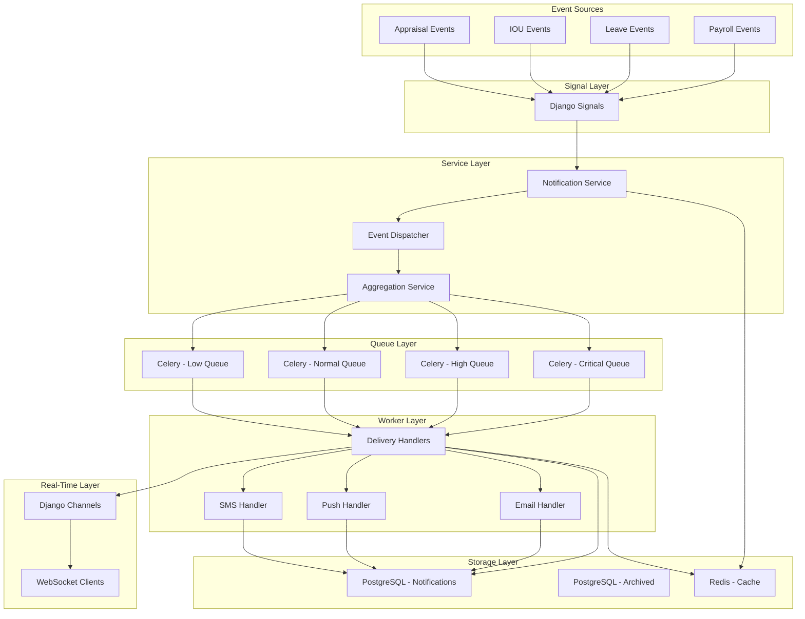
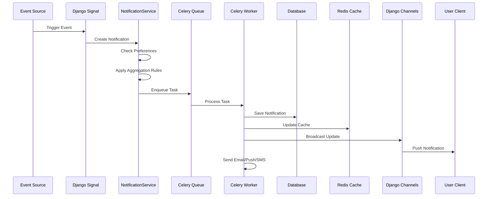
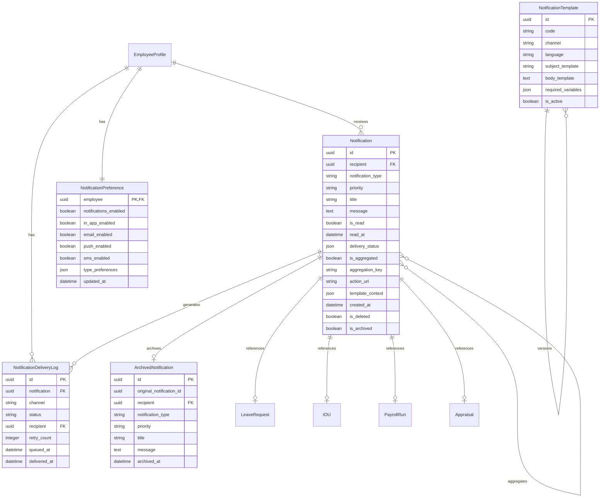
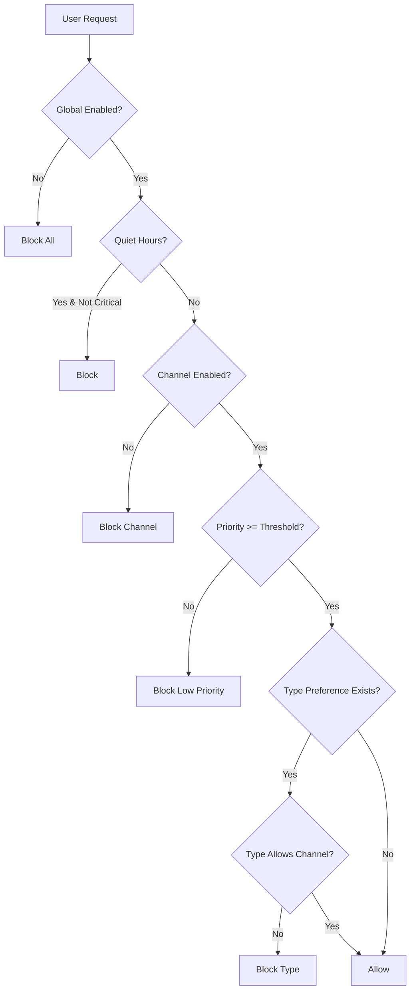
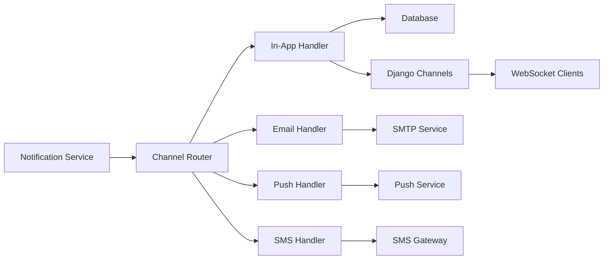
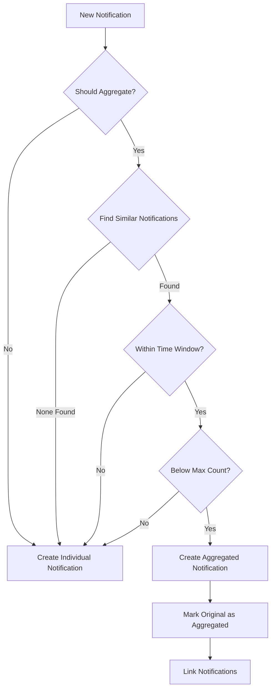

# Comprehensive Notification System Architecture Design
## Django Payroll Application

**Version:** 1.0  
**Date:** 2025-12-27  
**Status:** Design Document

---

## Table of Contents

1. [Executive Summary](#executive-summary)
2. [Current System Analysis](#current-system-analysis)
3. [System Requirements](#system-requirements)
4. [Architecture Overview](#architecture-overview)
5. [Database Schema Design](#database-schema-design)
6. [Notification Preference System](#notification-preference-system)
7. [Service Layer Architecture](#service-layer-architecture)
8. [Multi-Channel Delivery Strategy](#multi-channel-delivery-strategy)
9. [Notification Aggregation & Batching](#notification-aggregation--batching)
10. [Caching Strategy](#caching-strategy)
11. [Async Processing Architecture](#async-processing-architecture)
12. [Real-Time Updates](#real-time-updates)
13. [Archiving Strategy](#archiving-strategy)
14. [API Design](#api-design)
15. [Template Structure](#template-structure)
16. [Monitoring & Analytics](#monitoring--analytics)
17. [File Structure](#file-structure)
18. [Migration Strategy](#migration-strategy)
19. [Configuration Requirements](#configuration-requirements)
20. [Dependencies](#dependencies)
21. [Testing Strategy](#testing-strategy)
22. [Code Examples](#code-examples)
23. [Implementation Roadmap](#implementation-roadmap)

---

## Executive Summary

This document presents a comprehensive architecture for an enterprise-grade notification system for the Django payroll application. The design addresses critical limitations in the current system by introducing:

- **Priority-based notifications** with configurable urgency levels
- **Multi-channel delivery** (in-app, email, push notifications, SMS)
- **User preferences** for granular control over notification delivery
- **Asynchronous processing** using Celery for scalability
- **Real-time updates** via Django Channels
- **Intelligent aggregation** to reduce notification fatigue
- **Performance optimization** through caching and indexing
- **Automated archiving** for data retention management
- **Comprehensive monitoring** and analytics

The architecture follows Django best practices, leverages existing infrastructure (Redis, PostgreSQL), and provides a phased implementation approach for minimal disruption.

---

## Current System Analysis

### Existing Capabilities

1. **Basic Notification Model** ([`payroll/models/notification.py`](payroll/models/notification.py:8))
   - 12 notification types (LEAVE_APPROVED, LEAVE_REJECTED, etc.)
   - Read/unread tracking with timestamps
   - Foreign key relationships to related objects
   - Basic indexing on recipient, read status, and creation date

2. **Signal-Based Creation** ([`payroll/notification_signals.py`](payroll/notification_signals.py:1))
   - Automatic notification generation via Django signals
   - Event handlers for LeaveRequest, IOU, PayrollRun, and AppraisalAssignment
   - Bulk notification support for HR notifications

3. **View Layer** ([`payroll/views/notification_view.py`](payroll/views/notification_view.py:1))
   - List, detail, and dropdown views
   - Filtering by type and read status
   - Mark as read/unread functionality
   - Pagination support

### Identified Limitations

| Area | Current State | Required Enhancement |
|------|--------------|----------------------|
| **Priority System** | None | 4-level priority (critical, high, medium, low) |
| **Multi-Channel Delivery** | In-app only | Email, push notifications, SMS |
| **User Preferences** | None | Global and per-type preferences |
| **Async Processing** | Synchronous | Celery-based task queue |
| **Aggregation** | None | Group similar notifications |
| **Caching** | None | Redis-based caching for performance |
| **Real-Time** | None | Django Channels WebSocket support |
| **Archiving** | None | Automated archival to separate table |
| **Delivery Tracking** | Basic read status | Full delivery status per channel |
| **Retry Logic** | None | Automatic retry for failed deliveries |
| **Rate Limiting** | None | Per-user and per-channel limits |
| **Templates** | Hardcoded messages | Template-based message generation |
| **Analytics** | None | Delivery metrics and user engagement |

---

## System Requirements

### Functional Requirements

1. **FR-1: Enhanced Notification Model**
   - Support priority levels (CRITICAL, HIGH, MEDIUM, LOW)
   - Track delivery status per channel
   - Support notification grouping and aggregation
   - Include metadata for action URLs and deep linking
   - Store template context for dynamic rendering

2. **FR-2: User Preferences**
   - Global enable/disable per channel
   - Per-type preferences (e.g., email for payslips, in-app for leave)
   - Quiet hours configuration
   - Digest/batch preferences
   - Priority threshold per channel

3. **FR-3: Multi-Channel Delivery**
   - In-app notifications (existing, enhanced)
   - Email delivery with HTML templates
   - Push notifications (mobile/web)
   - SMS delivery (critical notifications only)

4. **FR-4: Aggregation & Batching**
   - Group similar notifications within time window
   - Daily/weekly digest options
   - Smart aggregation based on notification type
   - Configurable aggregation rules

5. **FR-5: Async Processing**
   - All notification creation via Celery tasks
   - Separate queues for different priorities
   - Automatic retry with exponential backoff
   - Dead letter queue for failed notifications

6. **FR-6: Real-Time Updates**
   - WebSocket connection for live notification delivery
   - Broadcast to connected clients
   - Presence tracking for active users

7. **FR-7: Archiving**
   - Automatic archival of old notifications (>90 days)
   - Separate archived_notifications table
   - Configurable retention policies
   - Restore capability

8. **FR-8: Caching**
   - Cache notification counts per user
   - Cache recent notifications list
   - Cache user preferences
   - Template caching

### Non-Functional Requirements

1. **NFR-1: Performance**
   - <100ms response time for notification list
   - Support 10,000+ concurrent users
   - <50ms for unread count retrieval
   - <500ms for notification creation

2. **NFR-2: Scalability**
   - Horizontal scaling via Celery workers
   - Support 1M+ notifications per day
   - Queue-based processing prevents bottlenecks

3. **NFR-3: Reliability**
   - 99.9% notification delivery rate
   - Automatic retry for transient failures
   - No data loss on system restart

4. **NFR-4: Maintainability**
   - Clear separation of concerns
   - Comprehensive logging
   - Easy to add new notification types
   - Template-based message generation

5. **NFR-5: Security**
   - User isolation (no cross-user access)
   - Rate limiting to prevent abuse
   - Secure WebSocket connections
   - Sensitive data redaction in logs

---

## Architecture Overview

### High-Level Architecture



### Component Interaction Flow



### Key Design Principles

1. **Separation of Concerns**: Clear boundaries between event detection, notification creation, and delivery
2. **Asynchronous Processing**: All heavy operations offloaded to background tasks
3. **Caching First**: Cache frequently accessed data to reduce database load
4. **Scalability**: Queue-based architecture allows horizontal scaling
5. **Reliability**: Retry mechanisms and dead letter queues ensure no lost notifications
6. **User Control**: Granular preferences give users control over their notification experience

---

## Database Schema Design

### Enhanced Notification Model

```python
# payroll/models/notification.py

class Notification(models.Model):
    """
    Enhanced notification model with priority, multi-channel support,
    and delivery tracking.
    """
    
    # Priority Levels
    PRIORITY_CHOICES = [
        ("CRITICAL", "Critical"),
        ("HIGH", "High"),
        ("MEDIUM", "Medium"),
        ("LOW", "Low"),
    ]
    
    # Notification Types (expanded from 12 to 20)
    NOTIFICATION_TYPES = [
        # Leave Notifications
        ("LEAVE_APPROVED", "Leave Approved"),
        ("LEAVE_REJECTED", "Leave Rejected"),
        ("LEAVE_PENDING", "Leave Pending"),
        ("LEAVE_CANCELLED", "Leave Cancelled"),
        ("LEAVE_REMINDER", "Leave Reminder"),
        
        # IOU Notifications
        ("IOU_APPROVED", "IOU Approved"),
        ("IOU_REJECTED", "IOU Rejected"),
        ("IOU_PENDING", "IOU Pending"),
        ("IOU_DUE", "IOU Payment Due"),
        
        # Payroll Notifications
        ("PAYSLIP_AVAILABLE", "Payslip Available"),
        ("PAYROLL_PROCESSED", "Payroll Processed"),
        ("PAYROLL_FAILED", "Payroll Processing Failed"),
        ("SALARY_DISBURSED", "Salary Disbursed"),
        
        # Appraisal Notifications
        ("APPRAISAL_ASSIGNED", "Appraisal Assigned"),
        ("APPRAISAL_COMPLETED", "Appraisal Completed"),
        ("APPRAISAL_REMINDER", "Appraisal Reminder"),
        
        # Profile Notifications
        ("PROFILE_UPDATED", "Profile Updated"),
        ("PASSWORD_CHANGED", "Password Changed"),
        
        # System Notifications
        ("INFO", "Information"),
        ("WARNING", "Warning"),
        ("ERROR", "Error"),
    ]
    
    # Delivery Status
    DELIVERY_STATUS_CHOICES = [
        ("PENDING", "Pending"),
        ("SENT", "Sent"),
        ("DELIVERED", "Delivered"),
        ("FAILED", "Failed"),
        ("RETRYING", "Retrying"),
    ]
    
    # Core Fields
    id = models.UUIDField(primary_key=True, default=uuid.uuid4, editable=False)
    recipient = models.ForeignKey(
        EmployeeProfile,
        on_delete=models.CASCADE,
        related_name="notifications",
        db_index=True
    )
    
    notification_type = models.CharField(
        max_length=50,
        choices=NOTIFICATION_TYPES,
        db_index=True
    )
    
    priority = models.CharField(
        max_length=20,
        choices=PRIORITY_CHOICES,
        default="MEDIUM",
        db_index=True
    )
    
    title = models.CharField(max_length=255)
    message = models.TextField()
    
    # Read Status
    is_read = models.BooleanField(default=False, db_index=True)
    read_at = models.DateTimeField(null=True, blank=True)
    
    # Delivery Tracking (per channel)
    delivery_status = models.JSONField(default=dict)
    # Example: {
    #   "in_app": {"status": "DELIVERED", "at": "2025-12-27T10:00:00Z"},
    #   "email": {"status": "SENT", "at": "2025-12-27T10:00:01Z", "message_id": "abc123"},
    #   "push": {"status": "FAILED", "error": "Device token expired", "retries": 3},
    #   "sms": {"status": "PENDING"}
    # }
    
    # Aggregation
    is_aggregated = models.BooleanField(default=False)
    aggregated_with = models.ManyToManyField(
        "self",
        symmetrical=False,
        blank=True,
        related_name="aggregated_notifications"
    )
    aggregation_key = models.CharField(max_length=255, blank=True, db_index=True)
    
    # Related Objects (maintain existing structure)
    leave_request = models.ForeignKey(
        "LeaveRequest",
        on_delete=models.SET_NULL,
        null=True,
        blank=True,
        related_name="notifications"
    )
    
    iou = models.ForeignKey(
        "IOU",
        on_delete=models.SET_NULL,
        null=True,
        blank=True,
        related_name="notifications"
    )
    
    payroll = models.ForeignKey(
        "PayrollRun",
        on_delete=models.SET_NULL,
        null=True,
        blank=True,
        related_name="notifications"
    )
    
    appraisal = models.ForeignKey(
        "Appraisal",
        on_delete=models.SET_NULL,
        null=True,
        blank=True,
        related_name="notifications"
    )
    
    # Action Links
    action_url = models.CharField(max_length=500, blank=True, null=True)
    action_label = models.CharField(max_length=100, blank=True, null=True)
    
    # Template Context (for dynamic rendering)
    template_context = models.JSONField(default=dict)
    # Example: {
    #   "employee_name": "John Doe",
    #   "leave_dates": "Jan 1-5, 2025",
    #   "amount": 50000
    # }
    
    # Metadata
    created_at = models.DateTimeField(auto_now_add=True, db_index=True)
    updated_at = models.DateTimeField(auto_now=True)
    expires_at = models.DateTimeField(null=True, blank=True)
    
    # Soft Delete
    is_deleted = models.BooleanField(default=False, db_index=True)
    deleted_at = models.DateTimeField(null=True, blank=True)
    
    # Archiving
    is_archived = models.BooleanField(default=False, db_index=True)
    archived_at = models.DateTimeField(null=True, blank=True)
    
    class Meta:
        ordering = ["-created_at"]
        indexes = [
            models.Index(fields=["recipient", "is_read"]),
            models.Index(fields=["-created_at"]),
            models.Index(fields=["notification_type"]),
            models.Index(fields=["priority"]),
            models.Index(fields=["recipient", "priority"]),
            models.Index(fields=["recipient", "is_archived"]),
            models.Index(fields=["aggregation_key"]),
            models.Index(fields=["is_deleted"]),
            # Composite indexes for common queries
            models.Index(fields=["recipient", "-created_at", "is_read"]),
            models.Index(fields=["recipient", "priority", "-created_at"]),
        ]
        verbose_name = "Notification"
        verbose_name_plural = "Notifications"
    
    def __str__(self):
        return f"{self.recipient} - {self.title}"
    
    def mark_as_read(self):
        """Mark notification as read"""
        from django.utils import timezone
        
        if not self.is_read:
            self.is_read = True
            self.read_at = timezone.now()
            self.save(update_fields=["is_read", "read_at"])
            self._invalidate_cache()
    
    def mark_as_unread(self):
        """Mark notification as unread"""
        self.is_read = False
        self.read_at = None
        self.save(update_fields=["is_read", "read_at"])
        self._invalidate_cache()
    
    def soft_delete(self):
        """Soft delete notification"""
        from django.utils import timezone
        
        self.is_deleted = True
        self.deleted_at = timezone.now()
        self.save(update_fields=["is_deleted", "deleted_at"])
        self._invalidate_cache()
    
    def update_delivery_status(self, channel, status, **metadata):
        """Update delivery status for a specific channel"""
        from django.utils import timezone
        
        if self.delivery_status is None:
            self.delivery_status = {}
        
        self.delivery_status[channel] = {
            "status": status,
            "at": timezone.now().isoformat(),
            **metadata
        }
        self.save(update_fields=["delivery_status"])
    
    def _invalidate_cache(self):
        """Invalidate related cache entries"""
        from django.core.cache import cache
        
        cache_key_patterns = [
            f"notifications:{self.recipient.id}:unread_count",
            f"notifications:{self.recipient.id}:recent",
        ]
        for pattern in cache_key_patterns:
            cache.delete(pattern)
    
    @property
    def icon_class(self):
        """Return Lucide icon class based on notification type"""
        icon_map = {
            "LEAVE_APPROVED": "check-circle",
            "LEAVE_REJECTED": "x-circle",
            "LEAVE_PENDING": "clock",
            "LEAVE_CANCELLED": "ban",
            "LEAVE_REMINDER": "alert-circle",
            "IOU_APPROVED": "dollar-sign",
            "IOU_REJECTED": "x-circle",
            "IOU_PENDING": "clock",
            "IOU_DUE": "alert-triangle",
            "PAYSLIP_AVAILABLE": "file-text",
            "PAYROLL_PROCESSED": "banknote",
            "PAYROLL_FAILED": "alert-octagon",
            "SALARY_DISBURSED": "credit-card",
            "APPRAISAL_ASSIGNED": "star",
            "APPRAISAL_COMPLETED": "award",
            "APPRAISAL_REMINDER": "bell",
            "PROFILE_UPDATED": "user",
            "PASSWORD_CHANGED": "lock",
            "INFO": "bell",
            "WARNING": "alert-triangle",
            "ERROR": "alert-octagon",
        }
        return icon_map.get(self.notification_type, "bell")
    
    @property
    def color_class(self):
        """Return color class based on priority"""
        color_map = {
            "CRITICAL": "red",
            "HIGH": "orange",
            "MEDIUM": "blue",
            "LOW": "gray",
        }
        return color_map.get(self.priority, "blue")
```

### Archived Notification Model

```python
# payroll/models/notification.py

class ArchivedNotification(models.Model):
    """
    Archived notifications for long-term storage and compliance.
    """
    
    id = models.UUIDField(primary_key=True, default=uuid.uuid4, editable=False)
    original_notification_id = models.UUIDField()
    
    recipient = models.ForeignKey(
        EmployeeProfile,
        on_delete=models.CASCADE,
        related_name="archived_notifications"
    )
    
    notification_type = models.CharField(max_length=50)
    priority = models.CharField(max_length=20)
    
    title = models.CharField(max_length=255)
    message = models.TextField()
    
    is_read = models.BooleanField(default=False)
    read_at = models.DateTimeField(null=True, blank=True)
    
    delivery_status = models.JSONField(default=dict)
    is_aggregated = models.BooleanField(default=False)
    aggregation_key = models.CharField(max_length=255, blank=True)
    
    action_url = models.CharField(max_length=500, blank=True, null=True)
    action_label = models.CharField(max_length=100, blank=True, null=True)
    
    template_context = models.JSONField(default=dict)
    
    created_at = models.DateTimeField(db_index=True)
    updated_at = models.DateTimeField()
    archived_at = models.DateTimeField(auto_now_add=True, db_index=True)
    
    class Meta:
        ordering = ["-archived_at"]
        indexes = [
            models.Index(fields=["recipient", "archived_at"]),
            models.Index(fields=["archived_at"]),
            models.Index(fields=["notification_type"]),
        ]
        verbose_name = "Archived Notification"
        verbose_name_plural = "Archived Notifications"
```

### Notification Preference Model

```python
# payroll/models/notification.py

class NotificationPreference(models.Model):
    """
    Global and per-type notification preferences for each user.
    """
    
    CHANNEL_CHOICES = [
        ("in_app", "In-App"),
        ("email", "Email"),
        ("push", "Push Notification"),
        ("sms", "SMS"),
    ]
    
    PRIORITY_THRESHOLD_CHOICES = [
        ("CRITICAL", "Critical Only"),
        ("HIGH", "High and Above"),
        ("MEDIUM", "Medium and Above"),
        ("LOW", "All Notifications"),
    ]
    
    DIGEST_FREQUENCY_CHOICES = [
        ("immediate", "Immediate"),
        ("hourly", "Hourly Digest"),
        ("daily", "Daily Digest"),
        ("weekly", "Weekly Digest"),
    ]
    
    # Core Fields
    employee = models.OneToOneField(
        EmployeeProfile,
        on_delete=models.CASCADE,
        related_name="notification_preferences"
    )
    
    # Global Settings
    notifications_enabled = models.BooleanField(default=True)
    
    # Per-Channel Settings
    in_app_enabled = models.BooleanField(default=True)
    email_enabled = models.BooleanField(default=True)
    push_enabled = models.BooleanField(default=False)
    sms_enabled = models.BooleanField(default=False)
    
    # Priority Thresholds per Channel
    in_app_priority_threshold = models.CharField(
        max_length=20,
        choices=PRIORITY_THRESHOLD_CHOICES,
        default="LOW"
    )
    email_priority_threshold = models.CharField(
        max_length=20,
        choices=PRIORITY_THRESHOLD_CHOICES,
        default="HIGH"
    )
    push_priority_threshold = models.CharField(
        max_length=20,
        choices=PRIORITY_THRESHOLD_CHOICES,
        default="HIGH"
    )
    sms_priority_threshold = models.CharField(
        max_length=20,
        choices=PRIORITY_THRESHOLD_CHOICES,
        default="CRITICAL"
    )
    
    # Digest Settings
    email_digest_frequency = models.CharField(
        max_length=20,
        choices=DIGEST_FREQUENCY_CHOICES,
        default="immediate"
    )
    push_digest_frequency = models.CharField(
        max_length=20,
        choices=DIGEST_FREQUENCY_CHOICES,
        default="immediate"
    )
    
    # Quiet Hours (no notifications during this period)
    quiet_hours_enabled = models.BooleanField(default=False)
    quiet_hours_start = models.TimeField(null=True, blank=True)
    quiet_hours_end = models.TimeField(null=True, blank=True)
    quiet_hours_timezone = models.CharField(max_length=50, default="UTC")
    
    # Per-Type Preferences (JSON for flexibility)
    type_preferences = models.JSONField(default=dict)
    # Example: {
    #   "LEAVE_APPROVED": {"in_app": True, "email": True, "push": False, "sms": False},
    #   "PAYSLIP_AVAILABLE": {"in_app": True, "email": True, "push": True, "sms": False},
    #   "INFO": {"in_app": True, "email": False, "push": False, "sms": False}
    # }
    
    # Metadata
    created_at = models.DateTimeField(auto_now_add=True)
    updated_at = models.DateTimeField(auto_now=True)
    
    class Meta:
        verbose_name = "Notification Preference"
        verbose_name_plural = "Notification Preferences"
    
    def __str__(self):
        return f"Preferences for {self.employee}"
    
    def should_send(self, notification_type, channel, priority):
        """
        Determine if a notification should be sent via a specific channel.
        """
        # Check if notifications are globally disabled
        if not self.notifications_enabled:
            return False
        
        # Check if channel is enabled
        channel_enabled = getattr(self, f"{channel}_enabled", False)
        if not channel_enabled:
            return False
        
        # Check priority threshold
        threshold = getattr(self, f"{channel}_priority_threshold", "LOW")
        priority_order = ["LOW", "MEDIUM", "HIGH", "CRITICAL"]
        if priority_order.index(priority) < priority_order.index(threshold):
            return False
        
        # Check type-specific preference
        if notification_type in self.type_preferences:
            type_pref = self.type_preferences[notification_type]
            if not type_pref.get(channel, True):
                return False
        
        # Check quiet hours
        if self.quiet_hours_enabled and self.quiet_hours_start and self.quiet_hours_end:
            from django.utils import timezone
            from pytz import timezone as tz
            
            user_tz = tz(self.quiet_hours_timezone)
            current_time = timezone.now().astimezone(user_tz).time()
            
            if self.quiet_hours_start <= current_time <= self.quiet_hours_end:
                # Only allow critical notifications during quiet hours
                if priority != "CRITICAL":
                    return False
        
        return True
    
    def get_digest_frequency(self, channel):
        """Get digest frequency for a specific channel"""
        return getattr(self, f"{channel}_digest_frequency", "immediate")
```

### Notification Delivery Log Model

```python
# payroll/models/notification.py

class NotificationDeliveryLog(models.Model):
    """
    Log of all notification delivery attempts for monitoring and debugging.
    """
    
    STATUS_CHOICES = [
        ("QUEUED", "Queued"),
        ("PROCESSING", "Processing"),
        ("SENT", "Sent"),
        ("DELIVERED", "Delivered"),
        ("FAILED", "Failed"),
        ("RETRYING", "Retrying"),
    ]
    
    CHANNEL_CHOICES = [
        ("in_app", "In-App"),
        ("email", "Email"),
        ("push", "Push Notification"),
        ("sms", "SMS"),
    ]
    
    id = models.UUIDField(primary_key=True, default=uuid.uuid4, editable=False)
    notification = models.ForeignKey(
        Notification,
        on_delete=models.CASCADE,
        related_name="delivery_logs"
    )
    
    channel = models.CharField(max_length=20, choices=CHANNEL_CHOICES, db_index=True)
    status = models.CharField(max_length=20, choices=STATUS_CHOICES, db_index=True)
    
    # Delivery Details
    recipient = models.ForeignKey(
        EmployeeProfile,
        on_delete=models.CASCADE,
        related_name="delivery_logs"
    )
    
    # Email-specific
    email_address = models.EmailField(blank=True, null=True)
    email_message_id = models.CharField(max_length=255, blank=True, null=True)
    
    # Push-specific
    device_token = models.CharField(max_length=255, blank=True, null=True)
    platform = models.CharField(max_length=20, blank=True, null=True)
    
    # SMS-specific
    phone_number = models.CharField(max_length=20, blank=True, null=True)
    sms_provider = models.CharField(max_length=50, blank=True, null=True)
    
    # Retry Information
    retry_count = models.IntegerField(default=0)
    max_retries = models.IntegerField(default=3)
    next_retry_at = models.DateTimeField(null=True, blank=True)
    
    # Error Information
    error_message = models.TextField(blank=True, null=True)
    error_code = models.CharField(max_length=50, blank=True, null=True)
    
    # Timing
    queued_at = models.DateTimeField(auto_now_add=True, db_index=True)
    processing_started_at = models.DateTimeField(null=True, blank=True)
    delivered_at = models.DateTimeField(null=True, blank=True)
    failed_at = models.DateTimeField(null=True, blank=True)
    
    class Meta:
        ordering = ["-queued_at"]
        indexes = [
            models.Index(fields=["notification", "channel"]),
            models.Index(fields=["status", "queued_at"]),
            models.Index(fields=["recipient", "queued_at"]),
            models.Index(fields=["channel", "status"]),
        ]
        verbose_name = "Notification Delivery Log"
        verbose_name_plural = "Notification Delivery Logs"
    
    def __str__(self):
        return f"{self.notification.title} - {self.channel} - {self.status}"
```

### Notification Template Model

```python
# payroll/models/notification.py

class NotificationTemplate(models.Model):
    """
    Templates for notification messages with support for multiple languages.
    """
    
    CHANNEL_CHOICES = [
        ("email", "Email"),
        ("push", "Push Notification"),
        ("sms", "SMS"),
        ("in_app", "In-App"),
    ]
    
    id = models.UUIDField(primary_key=True, default=uuid.uuid4, editable=False)
    
    # Template Identification
    code = models.CharField(max_length=100, unique=True, db_index=True)
    name = models.CharField(max_length=255)
    description = models.TextField(blank=True)
    
    # Template Content
    channel = models.CharField(max_length=20, choices=CHANNEL_CHOICES)
    language = models.CharField(max_length=10, default="en")
    
    subject_template = models.CharField(max_length=255, blank=True, null=True)
    body_template = models.TextField()
    
    # Required Variables (for validation)
    required_variables = models.JSONField(default=list)
    # Example: ["employee_name", "leave_dates", "amount"]
    
    # Metadata
    is_active = models.BooleanField(default=True)
    version = models.IntegerField(default=1)
    created_at = models.DateTimeField(auto_now_add=True)
    updated_at = models.DateTimeField(auto_now=True)
    
    class Meta:
        unique_together = [["code", "channel", "language", "version"]]
        ordering = ["code", "language", "-version"]
        indexes = [
            models.Index(fields=["code", "language"]),
            models.Index(fields=["channel", "is_active"]),
        ]
        verbose_name = "Notification Template"
        verbose_name_plural = "Notification Templates"
    
    def __str__(self):
        return f"{self.code} - {self.channel} - {self.language}"
    
    def render(self, context):
        """Render template with provided context"""
        from django.template import Template, Context as DjangoContext
        
        template = Template(self.body_template)
        return template.render(DjangoContext(context))
```

### Database Schema Diagram



---

## Notification Preference System

### Preference Hierarchy



### Preference Management Interface

```python
# payroll/services/preference_service.py

class PreferenceService:
    """
    Service for managing notification preferences.
    """
    
    @staticmethod
    def get_or_create_preferences(employee):
        """Get or create notification preferences for an employee"""
        preferences, created = NotificationPreference.objects.get_or_create(
            employee=employee
        )
        return preferences
    
    @staticmethod
    def update_preferences(employee, updates):
        """
        Update notification preferences.
        
        Args:
            employee: EmployeeProfile instance
            updates: dict of preference updates
            
        Example:
            {
                "email_enabled": True,
                "email_priority_threshold": "HIGH",
                "type_preferences": {
                    "LEAVE_APPROVED": {"email": True, "push": False}
                }
            }
        """
        preferences = PreferenceService.get_or_create_preferences(employee)
        
        for field, value in updates.items():
            if hasattr(preferences, field):
                setattr(preferences, field, value)
        
        preferences.save()
        
        # Invalidate cache
        cache.delete(f"preferences:{employee.id}")
        
        return preferences
    
    @staticmethod
    def get_default_preferences():
        """Get default preference values"""
        return {
            "notifications_enabled": True,
            "in_app_enabled": True,
            "email_enabled": True,
            "push_enabled": False,
            "sms_enabled": False,
            "in_app_priority_threshold": "LOW",
            "email_priority_threshold": "HIGH",
            "push_priority_threshold": "HIGH",
            "sms_priority_threshold": "CRITICAL",
            "email_digest_frequency": "immediate",
            "push_digest_frequency": "immediate",
            "quiet_hours_enabled": False,
            "type_preferences": {},
        }
    
    @staticmethod
    def export_preferences(employee):
        """Export preferences as JSON"""
        preferences = PreferenceService.get_or_create_preferences(employee)
        return {
            "employee_id": str(employee.id),
            "in_app_enabled": preferences.in_app_enabled,
            "email_enabled": preferences.email_enabled,
            "push_enabled": preferences.push_enabled,
            "sms_enabled": preferences.sms_enabled,
            "in_app_priority_threshold": preferences.in_app_priority_threshold,
            "email_priority_threshold": preferences.email_priority_threshold,
            "push_priority_threshold": preferences.push_priority_threshold,
            "sms_priority_threshold": preferences.sms_priority_threshold,
            "email_digest_frequency": preferences.email_digest_frequency,
            "push_digest_frequency": preferences.push_digest_frequency,
            "quiet_hours_enabled": preferences.quiet_hours_enabled,
            "quiet_hours_start": preferences.quiet_hours_start.isoformat() if preferences.quiet_hours_start else None,
            "quiet_hours_end": preferences.quiet_hours_end.isoformat() if preferences.quiet_hours_end else None,
            "type_preferences": preferences.type_preferences,
        }
    
    @staticmethod
    def import_preferences(employee, data):
        """Import preferences from JSON"""
        return PreferenceService.update_preferences(employee, data)
```

### Preference Validation

```python
# payroll/validators.py

class NotificationPreferenceValidator:
    """
    Validator for notification preference data.
    """
    
    VALID_CHANNELS = ["in_app", "email", "push", "sms"]
    VALID_PRIORITIES = ["LOW", "MEDIUM", "HIGH", "CRITICAL"]
    VALID_DIGEST_FREQUENCIES = ["immediate", "hourly", "daily", "weekly"]
    
    @classmethod
    def validate_preferences(cls, data):
        """Validate preference data"""
        errors = {}
        
        # Validate channel settings
        for channel in cls.VALID_CHANNELS:
            enabled_key = f"{channel}_enabled"
            if enabled_key in data and not isinstance(data[enabled_key], bool):
                errors[enabled_key] = "Must be a boolean"
            
            threshold_key = f"{channel}_priority_threshold"
            if threshold_key in data and data[threshold_key] not in cls.VALID_PRIORITIES:
                errors[threshold_key] = f"Must be one of {cls.VALID_PRIORITIES}"
            
            digest_key = f"{channel}_digest_frequency"
            if digest_key in data and data[digest_key] not in cls.VALID_DIGEST_FREQUENCIES:
                errors[digest_key] = f"Must be one of {cls.VALID_DIGEST_FREQUENCIES}"
        
        # Validate quiet hours
        if data.get("quiet_hours_enabled"):
            if not data.get("quiet_hours_start") or not data.get("quiet_hours_end"):
                errors["quiet_hours"] = "Start and end times required when quiet hours enabled"
        
        # Validate type preferences
        if "type_preferences" in data:
            for ntype, channels in data["type_preferences"].items():
                if not isinstance(channels, dict):
                    errors[f"type_preferences.{ntype}"] = "Must be a dictionary"
                    continue
                
                for channel, enabled in channels.items():
                    if channel not in cls.VALID_CHANNELS:
                        errors[f"type_preferences.{ntype}.{channel}"] = f"Invalid channel"
                    elif not isinstance(enabled, bool):
                        errors[f"type_preferences.{ntype}.{channel}"] = "Must be a boolean"
        
        return errors
```

---

## Service Layer Architecture

### Notification Service

```python
# payroll/services/notification_service.py

class NotificationService:
    """
    Main service for creating and managing notifications.
    """
    
    def __init__(self):
        self.preference_service = PreferenceService()
        self.aggregation_service = AggregationService()
        self.cache_service = NotificationCacheService()
    
    def create_notification(
        self,
        recipient,
        notification_type,
        title,
        message,
        priority="MEDIUM",
        **kwargs
    ):
        """
        Create a notification and queue it for delivery.
        
        Args:
            recipient: EmployeeProfile instance
            notification_type: str from NOTIFICATION_TYPES
            title: str notification title
            message: str notification message
            priority: str priority level
            **kwargs: Additional fields (leave_request, iou, payroll, etc.)
        
        Returns:
            Notification instance
        """
        # Check if recipient exists
        if not recipient:
            raise ValueError("Recipient is required")
        
        # Get user preferences
        preferences = self.preference_service.get_or_create_preferences(recipient)
        
        # Check if notifications are enabled
        if not preferences.notifications_enabled:
            return None
        
        # Create notification
        notification = Notification.objects.create(
            recipient=recipient,
            notification_type=notification_type,
            priority=priority,
            title=title,
            message=message,
            **kwargs
        )
        
        # Queue for delivery
        self._queue_notification_delivery(notification)
        
        return notification
    
    def create_bulk_notification(
        self,
        recipients,
        notification_type,
        title,
        message,
        priority="MEDIUM",
        **kwargs
    ):
        """
        Create notifications for multiple recipients.
        
        Args:
            recipients: QuerySet or list of EmployeeProfile instances
            notification_type: str from NOTIFICATION_TYPES
            title: str notification title
            message: str notification message
            priority: str priority level
            **kwargs: Additional fields
        
        Returns:
            List of Notification instances
        """
        notifications = []
        
        for recipient in recipients:
            try:
                notification = self.create_notification(
                    recipient=recipient,
                    notification_type=notification_type,
                    title=title,
                    message=message,
                    priority=priority,
                    **kwargs
                )
                if notification:
                    notifications.append(notification)
            except Exception as e:
                logger.error(f"Failed to create notification for {recipient}: {e}")
        
        return notifications
    
    def _queue_notification_delivery(self, notification):
        """Queue notification for async delivery"""
        from payroll.tasks import deliver_notification_task
        
        # Select queue based on priority
        queue_map = {
            "CRITICAL": "notifications_critical",
            "HIGH": "notifications_high",
            "MEDIUM": "notifications_normal",
            "LOW": "notifications_low",
        }
        
        queue = queue_map.get(notification.priority, "notifications_normal")
        
        # Enqueue task
        deliver_notification_task.apply_async(
            args=[str(notification.id)],
            queue=queue,
            countdown=0
        )
    
    def get_notifications(
        self,
        recipient,
        unread_only=False,
        notification_type=None,
        priority=None,
        limit=50,
        offset=0
    ):
        """
        Get notifications for a recipient with filtering.
        
        Args:
            recipient: EmployeeProfile instance
            unread_only: bool filter only unread
            notification_type: str filter by type
            priority: str filter by priority
            limit: int max results
            offset: int pagination offset
        
        Returns:
            QuerySet of Notification instances
        """
        # Try cache first
        cache_key = self.cache_service.get_notifications_cache_key(
            recipient.id, unread_only, notification_type, priority, limit, offset
        )
        
        cached = self.cache_service.get(cache_key)
        if cached:
            return cached
        
        # Build query
        queryset = Notification.objects.filter(
            recipient=recipient,
            is_deleted=False
        )
        
        if unread_only:
            queryset = queryset.filter(is_read=False)
        
        if notification_type:
            queryset = queryset.filter(notification_type=notification_type)
        
        if priority:
            queryset = queryset.filter(priority=priority)
        
        # Apply pagination
        queryset = queryset.select_related(
            "leave_request", "iou", "payroll", "appraisal"
        )[offset:offset + limit]
        
        # Cache result
        self.cache_service.set(cache_key, list(queryset), timeout=300)
        
        return queryset
    
    def get_unread_count(self, recipient):
        """Get unread notification count for a recipient"""
        cache_key = f"notifications:{recipient.id}:unread_count"
        
        cached = self.cache_service.get(cache_key)
        if cached is not None:
            return cached
        
        count = Notification.objects.filter(
            recipient=recipient,
            is_read=False,
            is_deleted=False
        ).count()
        
        self.cache_service.set(cache_key, count, timeout=300)
        
        return count
    
    def mark_as_read(self, notification_id, recipient):
        """Mark a notification as read"""
        try:
            notification = Notification.objects.get(
                id=notification_id,
                recipient=recipient
            )
            notification.mark_as_read()
            return True
        except Notification.DoesNotExist:
            return False
    
    def mark_all_as_read(self, recipient):
        """Mark all notifications as read for a recipient"""
        updated = Notification.objects.filter(
            recipient=recipient,
            is_read=False,
            is_deleted=False
        ).update(is_read=True, read_at=timezone.now())
        
        # Invalidate cache
        self.cache_service.delete(f"notifications:{recipient.id}:unread_count")
        
        return updated
    
    def delete_notification(self, notification_id, recipient):
        """Soft delete a notification"""
        try:
            notification = Notification.objects.get(
                id=notification_id,
                recipient=recipient
            )
            notification.soft_delete()
            return True
        except Notification.DoesNotExist:
            return False
```

### Event Dispatcher

```python
# payroll/services/event_dispatcher.py

class NotificationEventDispatcher:
    """
    Dispatches notification events to appropriate handlers.
    """
    
    def __init__(self):
        self.handlers = {}
        self._register_handlers()
    
    def _register_handlers(self):
        """Register event handlers"""
        self.handlers = {
            "leave.approved": LeaveApprovedHandler,
            "leave.rejected": LeaveRejectedHandler,
            "leave.pending": LeavePendingHandler,
            "iou.approved": IOUApprovedHandler,
            "iou.rejected": IOURejectedHandler,
            "iou.pending": IOUPendingHandler,
            "payslip.available": PayslipAvailableHandler,
            "payroll.processed": PayrollProcessedHandler,
            "appraisal.assigned": AppraisalAssignedHandler,
        }
    
    def dispatch(self, event_type, event_data):
        """
        Dispatch event to appropriate handler.
        
        Args:
            event_type: str event type
            event_data: dict event data
        """
        handler_class = self.handlers.get(event_type)
        
        if not handler_class:
            logger.warning(f"No handler registered for event: {event_type}")
            return
        
        handler = handler_class()
        handler.handle(event_data)


class BaseNotificationHandler:
    """Base class for notification handlers"""
    
    def handle(self, event_data):
        """Handle the event and create notifications"""
        raise NotImplementedError
    
    def create_notification(
        self,
        recipient,
        notification_type,
        title,
        message,
        priority="MEDIUM",
        **kwargs
    ):
        """Create notification via service"""
        from payroll.services.notification_service import NotificationService
        
        service = NotificationService()
        return service.create_notification(
            recipient=recipient,
            notification_type=notification_type,
            title=title,
            message=message,
            priority=priority,
            **kwargs
        )


class LeaveApprovedHandler(BaseNotificationHandler):
    """Handler for leave approval events"""
    
    def handle(self, event_data):
        leave_request = event_data["leave_request"]
        
        self.create_notification(
            recipient=leave_request.employee,
            notification_type="LEAVE_APPROVED",
            title="Leave Request Approved",
            message=f"Your {leave_request.leave_type.lower()} leave from {leave_request.start_date} to {leave_request.end_date} has been approved.",
            priority="HIGH",
            leave_request=leave_request,
            action_url=reverse("payroll:leave_requests")
        )


class PayslipAvailableHandler(BaseNotificationHandler):
    """Handler for payslip available events"""
    
    def handle(self, event_data):
        payday = event_data["payday"]
        employee = payday.payroll_entry.pays
        
        self.create_notification(
            recipient=employee,
            notification_type="PAYSLIP_AVAILABLE",
            title="Payslip Available",
            message=f"Your payslip for {payday.payroll_run.paydays} is now available. Net pay: ₦{payday.payroll_entry.netpay:,.2f}",
            priority="HIGH",
            payroll=payday.payroll_run,
            action_url=reverse("payroll:pay_period_detail", args=[payday.payroll_run.slug])
        )
```

### Aggregation Service

```python
# payroll/services/aggregation_service.py

class AggregationService:
    """
    Service for aggregating similar notifications.
    """
    
    # Aggregation rules per notification type
    AGGREGATION_RULES = {
        "LEAVE_PENDING": {
            "enabled": True,
            "time_window": 3600,  # 1 hour
            "group_by": ["recipient"],
            "max_count": 10,
        },
        "IOU_PENDING": {
            "enabled": True,
            "time_window": 3600,
            "group_by": ["recipient"],
            "max_count": 10,
        },
        "INFO": {
            "enabled": True,
            "time_window": 7200,  # 2 hours
            "group_by": ["recipient", "notification_type"],
            "max_count": 20,
        },
    }
    
    def should_aggregate(self, notification_type):
        """Check if notification type should be aggregated"""
        rule = self.AGGREGATION_RULES.get(notification_type, {})
        return rule.get("enabled", False)
    
    def get_aggregation_key(self, notification):
        """Generate aggregation key for a notification"""
        rule = self.AGGREGATION_RULES.get(notification.notification_type, {})
        group_by = rule.get("group_by", ["recipient"])
        
        key_parts = []
        for field in group_by:
            if field == "recipient":
                key_parts.append(str(notification.recipient.id))
            elif field == "notification_type":
                key_parts.append(notification.notification_type)
            elif hasattr(notification, field):
                key_parts.append(str(getattr(notification, field)))
        
        return ":".join(key_parts)
    
    def find_aggregatable_notifications(self, notification):
        """
        Find existing notifications that can be aggregated with this one.
        """
        if not self.should_aggregate(notification.notification_type):
            return []
        
        rule = self.AGGREGATION_RULES[notification.notification_type]
        time_window = timedelta(seconds=rule["time_window"])
        cutoff_time = timezone.now() - time_window
        
        aggregation_key = self.get_aggregation_key(notification)
        
        # Find recent notifications of same type for same recipient
        notifications = Notification.objects.filter(
            recipient=notification.recipient,
            notification_type=notification.notification_type,
            is_aggregated=False,
            is_deleted=False,
            created_at__gte=cutoff_time
        ).exclude(id=notification.id)[:rule["max_count"]]
        
        return list(notifications)
    
    def aggregate_notifications(self, notifications):
        """
        Aggregate multiple notifications into a single notification.
        """
        if len(notifications) < 2:
            return notifications[0] if notifications else None
        
        # Create aggregated notification
        primary = notifications[0]
        
        aggregated = Notification.objects.create(
            recipient=primary.recipient,
            notification_type=primary.notification_type,
            priority=primary.priority,
            title=f"{len(notifications)} {primary.notification_type.replace('_', ' ').title()}",
            message=f"You have {len(notifications)} pending {primary.notification_type.lower().replace('_', ' ')}.",
            is_aggregated=True,
            aggregation_key=self.get_aggregation_key(primary),
            template_context={
                "count": len(notifications),
                "notification_ids": [str(n.id) for n in notifications],
            }
        )
        
        # Link aggregated notifications
        aggregated.aggregated_with.add(*notifications)
        
        # Mark original notifications as aggregated
        for notification in notifications:
            notification.is_aggregated = True
            notification.save(update_fields=["is_aggregated"])
        
        return aggregated
```

---

## Multi-Channel Delivery Strategy

### Channel Architecture



### Base Channel Handler

```python
# payroll/services/channels/base_handler.py

class BaseChannelHandler:
    """Base class for notification channel handlers"""
    
    CHANNEL_NAME = None
    MAX_RETRIES = 3
    RETRY_DELAY = 60  # seconds
    
    def __init__(self, notification):
        self.notification = notification
        self.recipient = notification.recipient
        self.preference_service = PreferenceService()
    
    def should_send(self):
        """Check if notification should be sent via this channel"""
        preferences = self.preference_service.get_or_create_preferences(self.recipient)
        return preferences.should_send(
            self.notification.notification_type,
            self.CHANNEL_NAME,
            self.notification.priority
        )
    
    def deliver(self):
        """Deliver notification via this channel"""
        raise NotImplementedError
    
    def log_delivery(self, status, **metadata):
        """Log delivery attempt"""
        NotificationDeliveryLog.objects.create(
            notification=self.notification,
            channel=self.CHANNEL_NAME,
            status=status,
            recipient=self.recipient,
            **metadata
        )
    
    def update_notification_status(self, status, **metadata):
        """Update notification delivery status"""
        self.notification.update_delivery_status(self.CHANNEL_NAME, status, **metadata)
```

### In-App Handler

```python
# payroll/services/channels/in_app_handler.py

class InAppHandler(BaseChannelHandler):
    """Handler for in-app notifications"""
    
    CHANNEL_NAME = "in_app"
    
    def deliver(self):
        """Deliver in-app notification"""
        # In-app notifications are already saved to database
        # Just mark as delivered
        self.update_notification_status("DELIVERED")
        self.log_delivery("DELIVERED")
        
        # Broadcast via WebSocket
        self._broadcast_via_websocket()
        
        return True
    
    def _broadcast_via_websocket(self):
        """Broadcast notification via Django Channels"""
        from channels.layers import get_channel_layer
        from asgiref.sync import async_to_sync
        
        channel_layer = get_channel_layer()
        
        # Serialize notification
        notification_data = {
            "id": str(self.notification.id),
            "type": self.notification.notification_type,
            "priority": self.notification.priority,
            "title": self.notification.title,
            "message": self.notification.message,
            "created_at": self.notification.created_at.isoformat(),
            "action_url": self.notification.action_url,
        }
        
        # Send to user's notification group
        async_to_sync(channel_layer.group_send)(
            f"notifications_{self.recipient.id}",
            {
                "type": "notification_message",
                "notification": notification_data,
            }
        )
```

### Email Handler

```python
# payroll/services/channels/email_handler.py

class EmailHandler(BaseChannelHandler):
    """Handler for email notifications"""
    
    CHANNEL_NAME = "email"
    
    def deliver(self):
        """Deliver email notification"""
        from django.core.mail import EmailMultiAlternatives
        from django.template.loader import render_to_string
        
        # Get recipient email
        email_address = self.recipient.user.email
        if not email_address:
            self.log_delivery("FAILED", error_message="No email address for recipient")
            return False
        
        # Render email template
        template_code = self._get_template_code()
        template = NotificationTemplate.objects.filter(
            code=template_code,
            channel="email",
            is_active=True
        ).first()
        
        if template:
            subject = template.subject_template
            body = template.render(self.notification.template_context)
        else:
            # Fallback to default template
            subject = self.notification.title
            body = render_to_string(
                "notifications/email/default.html",
                {
                    "notification": self.notification,
                    "recipient": self.recipient,
                }
            )
        
        try:
            # Send email
            message = EmailMultiAlternatives(
                subject=subject,
                body=body,
                from_email=settings.DEFAULT_FROM_EMAIL,
                to=[email_address]
            )
            message.content_subtype = "html"
            message.send()
            
            self.update_notification_status("SENT", message_id=message.extra_headers.get("Message-ID"))
            self.log_delivery("SENT", email_address=email_address)
            return True
            
        except Exception as e:
            logger.error(f"Failed to send email: {e}")
            self.update_notification_status("FAILED", error=str(e))
            self.log_delivery("FAILED", email_address=email_address, error_message=str(e))
            return False
    
    def _get_template_code(self):
        """Get template code for notification type"""
        template_map = {
            "LEAVE_APPROVED": "leave.approved",
            "LEAVE_REJECTED": "leave.rejected",
            "PAYSLIP_AVAILABLE": "payslip.available",
            "PAYROLL_PROCESSED": "payroll.processed",
        }
        return template_map.get(self.notification.notification_type, "default")
```

### Push Notification Handler

```python
# payroll/services/channels/push_handler.py

class PushHandler(BaseChannelHandler):
    """Handler for push notifications"""
    
    CHANNEL_NAME = "push"
    
    def deliver(self):
        """Deliver push notification"""
        from fcm_django.models import FCMDevice
        
        # Get user's devices
        devices = FCMDevice.objects.filter(user=self.recipient.user, active=True)
        
        if not devices:
            self.log_delivery("FAILED", error_message="No active devices")
            return False
        
        # Prepare notification payload
        data_message = {
            "title": self.notification.title,
            "body": self.notification.message,
            "notification_id": str(self.notification.id),
            "type": self.notification.notification_type,
            "action_url": self.notification.action_url,
        }
        
        try:
            # Send to all devices
            devices.send_message(
                title=self.notification.title,
                body=self.notification.message,
                data=data_message
            )
            
            self.update_notification_status("SENT")
            self.log_delivery("SENT", device_count=devices.count())
            return True
            
        except Exception as e:
            logger.error(f"Failed to send push notification: {e}")
            self.update_notification_status("FAILED", error=str(e))
            self.log_delivery("FAILED", error_message=str(e))
            return False
```

### SMS Handler

```python
# payroll/services/channels/sms_handler.py

class SMSHandler(BaseChannelHandler):
    """Handler for SMS notifications"""
    
    CHANNEL_NAME = "sms"
    
    def deliver(self):
        """Deliver SMS notification"""
        from twilio.rest import Client
        
        # Get recipient phone number
        phone_number = self.recipient.phone_number
        if not phone_number:
            self.log_delivery("FAILED", error_message="No phone number for recipient")
            return False
        
        # Truncate message if too long
        message = self.notification.message[:160]
        
        try:
            # Send SMS via Twilio
            client = Client(
                settings.TWILIO_ACCOUNT_SID,
                settings.TWILIO_AUTH_TOKEN
            )
            
            message_obj = client.messages.create(
                body=message,
                from_=settings.TWILIO_PHONE_NUMBER,
                to=phone_number
            )
            
            self.update_notification_status(
                "SENT",
                message_id=message_obj.sid,
                provider="twilio"
            )
            self.log_delivery(
                "SENT",
                phone_number=phone_number,
                sms_provider="twilio",
                sms_message_id=message_obj.sid
            )
            return True
            
        except Exception as e:
            logger.error(f"Failed to send SMS: {e}")
            self.update_notification_status("FAILED", error=str(e))
            self.log_delivery(
                "FAILED",
                phone_number=phone_number,
                error_message=str(e)
            )
            return False
```

### Channel Router

```python
# payroll/services/channels/router.py

class ChannelRouter:
    """Router for delivering notifications via multiple channels"""
    
    def __init__(self, notification):
        self.notification = notification
        self.handlers = {
            "in_app": InAppHandler(notification),
            "email": EmailHandler(notification),
            "push": PushHandler(notification),
            "sms": SMSHandler(notification),
        }
    
    def deliver_all(self):
        """Deliver notification via all enabled channels"""
        results = {}
        
        for channel_name, handler in self.handlers.items():
            if handler.should_send():
                try:
                    success = handler.deliver()
                    results[channel_name] = success
                except Exception as e:
                    logger.error(f"Error delivering via {channel_name}: {e}")
                    results[channel_name] = False
            else:
                results[channel_name] = None  # Skipped
        
        return results
    
    def deliver_channel(self, channel_name):
        """Deliver notification via specific channel"""
        handler = self.handlers.get(channel_name)
        
        if not handler:
            logger.warning(f"Unknown channel: {channel_name}")
            return False
        
        if not handler.should_send():
            return None  # Skipped
        
        return handler.deliver()
```

---

## Notification Aggregation & Batching

### Aggregation Strategy



### Digest Service

```python
# payroll/services/digest_service.py

class DigestService:
    """
    Service for creating and sending notification digests.
    """
    
    def __init__(self):
        self.notification_service = NotificationService()
        self.email_handler = EmailHandler
    
    def create_digest(self, recipient, frequency="daily"):
        """
        Create a digest notification for a recipient.
        
        Args:
            recipient: EmployeeProfile instance
            frequency: str (daily, weekly)
        """
        # Get time range
        if frequency == "daily":
            start_time = timezone.now() - timedelta(days=1)
        elif frequency == "weekly":
            start_time = timezone.now() - timedelta(weeks=1)
        else:
            raise ValueError(f"Invalid frequency: {frequency}")
        
        # Get unread notifications in range
        notifications = Notification.objects.filter(
            recipient=recipient,
            is_read=False,
            is_deleted=False,
            created_at__gte=start_time
        ).select_related("leave_request", "iou", "payroll", "appraisal")
        
        if not notifications.exists():
            return None
        
        # Group by type
        grouped = {}
        for notification in notifications:
            ntype = notification.notification_type
            if ntype not in grouped:
                grouped[ntype] = []
            grouped[ntype].append(notification)
        
        # Create digest notification
        digest_notification = Notification.objects.create(
            recipient=recipient,
            notification_type="INFO",
            priority="LOW",
            title=f"{frequency.capitalize()} Notification Digest",
            message=f"You have {notifications.count()} new notifications.",
            template_context={
                "frequency": frequency,
                "total_count": notifications.count(),
                "grouped": {
                    ntype: [n.id for n in notifs]
                    for ntype, notifs in grouped.items()
                },
            },
            action_url=reverse("notifications:list")
        )
        
        # Mark original notifications as aggregated
        for notification in notifications:
            notification.is_aggregated = True
            notification.save(update_fields=["is_aggregated"])
        
        return digest_notification
    
    def send_daily_digests(self):
        """Send daily digests to all users who prefer them"""
        preferences = NotificationPreference.objects.filter(
            email_enabled=True,
            email_digest_frequency="daily"
        )
        
        for pref in preferences:
            try:
                digest = self.create_digest(pref.employee, "daily")
                if digest:
                    # Queue for email delivery
                    deliver_notification_task.apply_async(
                        args=[str(digest.id)],
                        queue="notifications_normal"
                    )
            except Exception as e:
                logger.error(f"Failed to create digest for {pref.employee}: {e}")
    
    def send_weekly_digests(self):
        """Send weekly digests to all users who prefer them"""
        preferences = NotificationPreference.objects.filter(
            email_enabled=True,
            email_digest_frequency="weekly"
        )
        
        for pref in preferences:
            try:
                digest = self.create_digest(pref.employee, "weekly")
                if digest:
                    # Queue for email delivery
                    deliver_notification_task.apply_async(
                        args=[str(digest.id)],
                        queue="notifications_normal"
                    )
            except Exception as e:
                logger.error(f"Failed to create digest for {pref.employee}: {e}")
```

---

## Caching Strategy

### Cache Service

```python
# payroll/services/cache_service.py

class NotificationCacheService:
    """
    Service for caching notification-related data.
    """
    
    CACHE_PREFIX = "notifications"
    DEFAULT_TIMEOUT = 300  # 5 minutes
    
    def get(self, key):
        """Get value from cache"""
        from django.core.cache import cache
        
        return cache.get(key)
    
    def set(self, key, value, timeout=None):
        """Set value in cache"""
        from django.core.cache import cache
        
        if timeout is None:
            timeout = self.DEFAULT_TIMEOUT
        
        cache.set(key, value, timeout)
    
    def delete(self, key):
        """Delete value from cache"""
        from django.core.cache import cache
        
        cache.delete(key)
    
    def delete_pattern(self, pattern):
        """Delete all keys matching a pattern"""
        from django.core.cache import cache
        from django_redis import get_redis_connection
        
        redis = get_redis_connection("default")
        keys = redis.keys(f"{self.CACHE_PREFIX}:{pattern}")
        
        if keys:
            cache.delete_many(keys)
    
    def get_notifications_cache_key(
        self,
        recipient_id,
        unread_only=False,
        notification_type=None,
        priority=None,
        limit=50,
        offset=0
    ):
        """Generate cache key for notifications query"""
        parts = [
            self.CACHE_PREFIX,
            str(recipient_id),
            "unread" if unread_only else "all",
        ]
        
        if notification_type:
            parts.append(notification_type)
        
        if priority:
            parts.append(priority)
        
        parts.extend([str(limit), str(offset)])
        
        return ":".join(parts)
    
    def invalidate_user_cache(self, recipient_id):
        """Invalidate all cache entries for a user"""
        self.delete_pattern(f"{recipient_id}:*")
    
    def get_unread_count_cache_key(self, recipient_id):
        """Get cache key for unread count"""
        return f"{self.CACHE_PREFIX}:{recipient_id}:unread_count"
    
    def get_preferences_cache_key(self, recipient_id):
        """Get cache key for user preferences"""
        return f"{self.CACHE_PREFIX}:{recipient_id}:preferences"
    
    def cache_unread_count(self, recipient_id, count):
        """Cache unread count for a user"""
        key = self.get_unread_count_cache_key(recipient_id)
        self.set(key, count, timeout=300)
    
    def cache_preferences(self, recipient_id, preferences):
        """Cache user preferences"""
        key = self.get_preferences_cache_key(recipient_id)
        self.set(key, preferences, timeout=3600)  # 1 hour
```

### Cache Invalidation Strategy

```python
# payroll/services/cache_invalidation.py

class CacheInvalidationService:
    """
    Service for managing cache invalidation.
    """
    
    @staticmethod
    def on_notification_created(notification):
        """Invalidate cache when notification is created"""
        cache_service = NotificationCacheService()
        
        # Invalidate unread count
        cache_service.delete(
            cache_service.get_unread_count_cache_key(notification.recipient.id)
        )
        
        # Invalidate notification lists
        cache_service.invalidate_user_cache(notification.recipient.id)
    
    @staticmethod
    def on_notification_read(notification):
        """Invalidate cache when notification is read"""
        cache_service = NotificationCacheService()
        
        # Invalidate unread count
        cache_service.delete(
            cache_service.get_unread_count_cache_key(notification.recipient.id)
        )
    
    @staticmethod
    def on_notification_deleted(notification):
        """Invalidate cache when notification is deleted"""
        cache_service = NotificationCacheService()
        
        # Invalidate unread count
        cache_service.delete(
            cache_service.get_unread_count_cache_key(notification.recipient.id)
        )
        
        # Invalidate notification lists
        cache_service.invalidate_user_cache(notification.recipient.id)
    
    @staticmethod
    def on_preferences_updated(employee):
        """Invalidate cache when preferences are updated"""
        cache_service = NotificationCacheService()
        
        # Invalidate preferences cache
        cache_service.delete(
            cache_service.get_preferences_cache_key(employee.id)
        )
```

---

## Async Processing Architecture

### Celery Configuration

```python
# core/celery.py

import os
from celery import Celery

# Set default Django settings
os.environ.setdefault("DJANGO_SETTINGS_MODULE", "core.settings")

app = Celery("payroll")

# Load configuration from Django settings
app.config_from_object("django.conf:settings", namespace="CELERY")

# Auto-discover tasks
app.autodiscover_tasks()

# Task queues
app.conf.task_queues = {
    "notifications_critical": {
        "exchange": "notifications",
        "routing_key": "notifications.critical",
    },
    "notifications_high": {
        "exchange": "notifications",
        "routing_key": "notifications.high",
    },
    "notifications_normal": {
        "exchange": "notifications",
        "routing_key": "notifications.normal",
    },
    "notifications_low": {
        "exchange": "notifications",
        "routing_key": "notifications.low",
    },
}

# Task routing
app.conf.task_routes = {
    "payroll.tasks.deliver_notification_task": {
        "queue": "notifications_normal",
    },
    "payroll.tasks.send_digest_task": {
        "queue": "notifications_low",
    },
}

# Retry settings
app.conf.task_acks_late = True
app.conf.task_reject_on_worker_lost = True

# Rate limiting
app.conf.task_annotations = {
    "payroll.tasks.deliver_notification_task": {
        "rate_limit": "100/m",
    },
}

@app.task(bind=True)
def debug_task(self):
    print(f"Request: {self.request!r}")
```

### Celery Tasks

```python
# payroll/tasks.py

from celery import shared_task
from celery.utils.log import get_task_logger

logger = get_task_logger(__name__)


@shared_task(
    bind=True,
    max_retries=3,
    default_retry_delay=60,
)
def deliver_notification_task(self, notification_id):
    """
    Deliver notification via all enabled channels.
    
    Args:
        notification_id: UUID of notification to deliver
    """
    from payroll.models import Notification
    from payroll.services.channels.router import ChannelRouter
    
    try:
        notification = Notification.objects.get(id=notification_id)
        
        # Create channel router
        router = ChannelRouter(notification)
        
        # Deliver via all channels
        results = router.deliver_all()
        
        logger.info(f"Delivered notification {notification_id}: {results}")
        
        return results
        
    except Notification.DoesNotExist:
        logger.error(f"Notification {notification_id} not found")
        return None
        
    except Exception as e:
        logger.error(f"Error delivering notification {notification_id}: {e}")
        
        # Retry with exponential backoff
        raise self.retry(exc=e, countdown=2 ** self.request.retries)


@shared_task
def send_digest_task(recipient_id, frequency="daily"):
    """
    Send digest notification to recipient.
    
    Args:
        recipient_id: UUID of recipient
        frequency: str (daily, weekly)
    """
    from payroll.models import EmployeeProfile
    from payroll.services.digest_service import DigestService
    
    try:
        recipient = EmployeeProfile.objects.get(id=recipient_id)
        
        digest_service = DigestService()
        digest = digest_service.create_digest(recipient, frequency)
        
        if digest:
            # Queue for email delivery
            deliver_notification_task.apply_async(
                args=[str(digest.id)],
                queue="notifications_normal"
            )
            
        logger.info(f"Sent {frequency} digest to {recipient_id}")
        
    except EmployeeProfile.DoesNotExist:
        logger.error(f"Recipient {recipient_id} not found")
        
    except Exception as e:
        logger.error(f"Error sending digest to {recipient_id}: {e}")


@shared_task
def archive_old_notifications_task():
    """
    Archive notifications older than retention period.
    """
    from payroll.models import Notification, ArchivedNotification
    from django.utils import timezone
    
    # Get retention period from settings
    retention_days = getattr(settings, "NOTIFICATION_RETENTION_DAYS", 90)
    cutoff_date = timezone.now() - timedelta(days=retention_days)
    
    # Get old notifications
    old_notifications = Notification.objects.filter(
        created_at__lt=cutoff_date,
        is_archived=False
    )
    
    count = old_notifications.count()
    
    # Archive in batches
    batch_size = 1000
    for i in range(0, count, batch_size):
        batch = old_notifications[i:i + batch_size]
        
        # Create archived notifications
        archived = []
        for notification in batch:
            archived.append(ArchivedNotification(
                original_notification_id=notification.id,
                recipient=notification.recipient,
                notification_type=notification.notification_type,
                priority=notification.priority,
                title=notification.title,
                message=notification.message,
                is_read=notification.is_read,
                read_at=notification.read_at,
                delivery_status=notification.delivery_status,
                is_aggregated=notification.is_aggregated,
                aggregation_key=notification.aggregation_key,
                action_url=notification.action_url,
                action_label=notification.action_label,
                template_context=notification.template_context,
                created_at=notification.created_at,
                updated_at=notification.updated_at,
            ))
        
        ArchivedNotification.objects.bulk_create(archived)
        
        # Mark original as archived
        batch.update(is_archived=True, archived_at=timezone.now())
    
    logger.info(f"Archived {count} notifications")
    
    return count


@shared_task
def cleanup_failed_deliveries_task():
    """
    Clean up failed delivery logs older than 30 days.
    """
    from payroll.models import NotificationDeliveryLog
    
    cutoff_date = timezone.now() - timedelta(days=30)
    
    deleted = NotificationDeliveryLog.objects.filter(
        status="FAILED",
        queued_at__lt=cutoff_date
    ).delete()
    
    logger.info(f"Cleaned up {deleted[0]} failed delivery logs")
    
    return deleted[0]


# Scheduled tasks (using celery-beat)
@shared_task
def schedule_daily_digests():
    """Schedule daily digest delivery for all users"""
    from payroll.services.digest_service import DigestService
    
    digest_service = DigestService()
    digest_service.send_daily_digests()


@shared_task
def schedule_weekly_digests():
    """Schedule weekly digest delivery for all users"""
    from payroll.services.digest_service import DigestService
    
    digest_service = DigestService()
    digest_service.send_weekly_digests()
```

### Celery Beat Schedule

```python
# core/settings.py

CELERY_BEAT_SCHEDULE = {
    "archive-old-notifications": {
        "task": "payroll.tasks.archive_old_notifications_task",
        "schedule": crontab(hour=2, minute=0),  # 2 AM daily
    },
    "cleanup-failed-deliveries": {
        "task": "payroll.tasks.cleanup_failed_deliveries_task",
        "schedule": crontab(hour=3, minute=0),  # 3 AM daily
    },
    "send-daily-digests": {
        "task": "payroll.tasks.schedule_daily_digests",
        "schedule": crontab(hour=8, minute=0),  # 8 AM daily
    },
    "send-weekly-digests": {
        "task": "payroll.tasks.schedule_weekly_digests",
        "schedule": crontab(hour=8, minute=0, day_of_week=1),  # 8 AM Monday
    },
}
```

---

## Real-Time Updates

### Django Channels Configuration

```python
# core/routing.py

from django.urls import re_path
from . import consumers

websocket_urlpatterns = [
    re_path(r"ws/notifications/$", consumers.NotificationConsumer.as_asgi()),
]
```

### Notification Consumer

```python
# payroll/consumers.py

import json
from channels.generic.websocket import AsyncWebsocketConsumer
from channels.db import database_sync_to_async


class NotificationConsumer(AsyncWebsocketConsumer):
    """
    WebSocket consumer for real-time notification delivery.
    """
    
    async def connect(self):
        """Handle WebSocket connection"""
        # Get user from scope
        self.user = self.scope["user"]
        
        if not self.user.is_authenticated:
            await self.close()
            return
        
        # Get employee profile
        try:
            self.employee = await database_sync_to_async(
                lambda: self.user.employee_user
            )()
        except:
            await self.close()
            return
        
        # Create notification group for this user
        self.group_name = f"notifications_{self.employee.id}"
        
        # Join group
        await self.channel_layer.group_add(
            self.group_name,
            self.channel_name
        )
        
        await self.accept()
        
        # Send initial unread count
        await self.send_unread_count()
    
    async def disconnect(self, close_code):
        """Handle WebSocket disconnection"""
        # Leave group
        await self.channel_layer.group_discard(
            self.group_name,
            self.channel_name
        )
    
    async def receive(self, text_data):
        """Handle incoming WebSocket messages"""
        try:
            data = json.loads(text_data)
            action = data.get("action")
            
            if action == "mark_read":
                notification_id = data.get("notification_id")
                await self.mark_as_read(notification_id)
            
            elif action == "mark_all_read":
                await self.mark_all_as_read()
            
            elif action == "get_unread_count":
                await self.send_unread_count()
            
        except Exception as e:
            logger.error(f"Error handling WebSocket message: {e}")
    
    async def notification_message(self, event):
        """Handle new notification message"""
        notification = event["notification"]
        
        # Send notification to client
        await self.send(text_data=json.dumps({
            "type": "notification",
            "notification": notification,
        }))
        
        # Update unread count
        await self.send_unread_count()
    
    async def send_unread_count(self):
        """Send unread count to client"""
        count = await database_sync_to_async(
            lambda: Notification.objects.filter(
                recipient=self.employee,
                is_read=False,
                is_deleted=False
            ).count()
        )()
        
        await self.send(text_data=json.dumps({
            "type": "unread_count",
            "count": count,
        }))
    
    async def mark_as_read(self, notification_id):
        """Mark notification as read"""
        try:
            notification = await database_sync_to_async(
                Notification.objects.get
            )(id=notification_id, recipient=self.employee)
            
            await database_sync_to_async(notification.mark_as_read)()
            
            # Send updated unread count
            await self.send_unread_count()
            
        except Notification.DoesNotExist:
            pass
    
    async def mark_all_as_read(self):
        """Mark all notifications as read"""
        from django.utils import timezone
        
        await database_sync_to_async(
            Notification.objects.filter(
                recipient=self.employee,
                is_read=False
            ).update
        )(is_read=True, read_at=timezone.now())
        
        # Send updated unread count
        await self.send_unread_count()
```

### ASGI Configuration

```python
# core/asgi.py

import os
from django.core.asgi import get_asgi_application
from channels.routing import ProtocolTypeRouter, URLRouter
from channels.auth import AuthMiddlewareStack

os.environ.setdefault("DJANGO_SETTINGS_MODULE", "core.settings")

django_asgi_app = get_asgi_application()

from core.routing import websocket_urlpatterns

application = ProtocolTypeRouter({
    "http": django_asgi_app,
    "websocket": AuthMiddlewareStack(
        URLRouter(websocket_urlpatterns)
    ),
})
```

---

## Archiving Strategy

### Archival Service

```python
# payroll/services/archival_service.py

class ArchivalService:
    """
    Service for archiving and managing old notifications.
    """
    
    @staticmethod
    def archive_notification(notification):
        """Archive a single notification"""
        archived = ArchivedNotification.objects.create(
            original_notification_id=notification.id,
            recipient=notification.recipient,
            notification_type=notification.notification_type,
            priority=notification.priority,
            title=notification.title,
            message=notification.message,
            is_read=notification.is_read,
            read_at=notification.read_at,
            delivery_status=notification.delivery_status,
            is_aggregated=notification.is_aggregated,
            aggregation_key=notification.aggregation_key,
            action_url=notification.action_url,
            action_label=notification.action_label,
            template_context=notification.template_context,
            created_at=notification.created_at,
            updated_at=notification.updated_at,
        )
        
        # Mark original as archived
        notification.is_archived = True
        notification.archived_at = timezone.now()
        notification.save(update_fields=["is_archived", "archived_at"])
        
        return archived
    
    @staticmethod
    def archive_old_notifications(days=90):
        """Archive notifications older than specified days"""
        cutoff_date = timezone.now() - timedelta(days=days)
        
        old_notifications = Notification.objects.filter(
            created_at__lt=cutoff_date,
            is_archived=False
        )
        
        count = 0
        for notification in old_notifications.iterator():
            ArchivalService.archive_notification(notification)
            count += 1
        
        return count
    
    @staticmethod
    def restore_notification(archived_notification):
        """Restore an archived notification"""
        notification = Notification.objects.create(
            id=archived_notification.original_notification_id,
            recipient=archived_notification.recipient,
            notification_type=archived_notification.notification_type,
            priority=archived_notification.priority,
            title=archived_notification.title,
            message=archived_notification.message,
            is_read=archived_notification.is_read,
            read_at=archived_notification.read_at,
            delivery_status=archived_notification.delivery_status,
            is_aggregated=archived_notification.is_aggregated,
            aggregation_key=archived_notification.aggregation_key,
            action_url=archived_notification.action_url,
            action_label=archived_notification.action_label,
            template_context=archived_notification.template_context,
            created_at=archived_notification.created_at,
            updated_at=archived_notification.updated_at,
            is_archived=False,
        )
        
        # Delete archived version
        archived_notification.delete()
        
        return notification
    
    @staticmethod
    def get_archived_notifications(recipient, limit=50):
        """Get archived notifications for a recipient"""
        return ArchivedNotification.objects.filter(
            recipient=recipient
        ).order_by("-archived_at")[:limit]
```

---

## API Design

### REST API Endpoints

```python
# api/urls.py

from django.urls import path
from .views import (
    NotificationListView,
    NotificationDetailView,
    NotificationMarkReadView,
    NotificationMarkUnreadView,
    NotificationMarkAllReadView,
    NotificationDeleteView,
    NotificationCountView,
    NotificationPreferencesView,
)

urlpatterns = [
    path("notifications/", NotificationListView.as_view(), name="notification-list"),
    path("notifications/<uuid:pk>/", NotificationDetailView.as_view(), name="notification-detail"),
    path("notifications/<uuid:pk>/mark-read/", NotificationMarkReadView.as_view(), name="notification-mark-read"),
    path("notifications/<uuid:pk>/mark-unread/", NotificationMarkUnreadView.as_view(), name="notification-mark-unread"),
    path("notifications/mark-all-read/", NotificationMarkAllReadView.as_view(), name="notification-mark-all-read"),
    path("notifications/<uuid:pk>/", NotificationDeleteView.as_view(), name="notification-delete"),
    path("notifications/unread-count/", NotificationCountView.as_view(), name="notification-count"),
    path("notifications/preferences/", NotificationPreferencesView.as_view(), name="notification-preferences"),
]
```

### API Views

```python
# api/views.py

from rest_framework import viewsets, status
from rest_framework.decorators import action
from rest_framework.response import Response
from rest_framework.views import APIView
from rest_framework.permissions import IsAuthenticated
from rest_framework.pagination import PageNumberPagination

from payroll.models import Notification, NotificationPreference
from payroll.serializers import NotificationSerializer, NotificationPreferenceSerializer


class NotificationPagination(PageNumberPagination):
    """Custom pagination for notifications"""
    page_size = 20
    page_size_query_param = "page_size"
    max_page_size = 100


class NotificationListView(APIView):
    """List and create notifications"""
    
    permission_classes = [IsAuthenticated]
    pagination_class = NotificationPagination
    
    def get(self, request):
        """Get notifications for current user"""
        try:
            employee = request.user.employee_user
        except:
            return Response(
                {"error": "Employee profile not found"},
                status=status.HTTP_404_NOT_FOUND
            )
        
        # Get query parameters
        unread_only = request.query_params.get("unread_only", "false").lower() == "true"
        notification_type = request.query_params.get("type")
        priority = request.query_params.get("priority")
        
        # Get notifications
        service = NotificationService()
        notifications = service.get_notifications(
            recipient=employee,
            unread_only=unread_only,
            notification_type=notification_type,
            priority=priority,
            limit=100
        )
        
        # Paginate
        paginator = self.pagination_class()
        page = paginator.paginate_queryset(notifications, request)
        
        serializer = NotificationSerializer(page, many=True)
        
        return paginator.get_paginated_response(serializer.data)


class NotificationDetailView(APIView):
    """Retrieve, update, or delete a notification"""
    
    permission_classes = [IsAuthenticated]
    
    def get(self, request, pk):
        """Get notification details"""
        try:
            employee = request.user.employee_user
            notification = Notification.objects.get(
                id=pk,
                recipient=employee,
                is_deleted=False
            )
        except Notification.DoesNotExist:
            return Response(
                {"error": "Notification not found"},
                status=status.HTTP_404_NOT_FOUND
            )
        
        serializer = NotificationSerializer(notification)
        
        # Mark as read when viewed
        notification.mark_as_read()
        
        return Response(serializer.data)


class NotificationMarkReadView(APIView):
    """Mark notification as read"""
    
    permission_classes = [IsAuthenticated]
    
    def post(self, request, pk):
        """Mark notification as read"""
        try:
            employee = request.user.employee_user
            notification = Notification.objects.get(
                id=pk,
                recipient=employee
            )
        except Notification.DoesNotExist:
            return Response(
                {"error": "Notification not found"},
                status=status.HTTP_404_NOT_FOUND
            )
        
        notification.mark_as_read()
        
        return Response({"success": True})


class NotificationMarkAllReadView(APIView):
    """Mark all notifications as read"""
    
    permission_classes = [IsAuthenticated]
    
    def post(self, request):
        """Mark all notifications as read"""
        try:
            employee = request.user.employee_user
        except:
            return Response(
                {"error": "Employee profile not found"},
                status=status.HTTP_404_NOT_FOUND
            )
        
        service = NotificationService()
        count = service.mark_all_as_read(employee)
        
        return Response({"success": True, "count": count})


class NotificationCountView(APIView):
    """Get unread notification count"""
    
    permission_classes = [IsAuthenticated]
    
    def get(self, request):
        """Get unread count"""
        try:
            employee = request.user.employee_user
        except:
            return Response(
                {"error": "Employee profile not found"},
                status=status.HTTP_404_NOT_FOUND
            )
        
        service = NotificationService()
        count = service.get_unread_count(employee)
        
        return Response({"unread_count": count})


class NotificationPreferencesView(APIView):
    """Get or update notification preferences"""
    
    permission_classes = [IsAuthenticated]
    
    def get(self, request):
        """Get notification preferences"""
        try:
            employee = request.user.employee_user
        except:
            return Response(
                {"error": "Employee profile not found"},
                status=status.HTTP_404_NOT_FOUND
            )
        
        preferences = PreferenceService.get_or_create_preferences(employee)
        serializer = NotificationPreferenceSerializer(preferences)
        
        return Response(serializer.data)
    
    def put(self, request):
        """Update notification preferences"""
        try:
            employee = request.user.employee_user
        except:
            return Response(
                {"error": "Employee profile not found"},
                status=status.HTTP_404_NOT_FOUND
            )
        
        # Validate preferences
        validator = NotificationPreferenceValidator()
        errors = validator.validate_preferences(request.data)
        
        if errors:
            return Response(
                {"errors": errors},
                status=status.HTTP_400_BAD_REQUEST
            )
        
        # Update preferences
        preferences = PreferenceService.update_preferences(employee, request.data)
        serializer = NotificationPreferenceSerializer(preferences)
        
        return Response(serializer.data)
```

### API Serializers

```python
# api/serializers.py

from rest_framework import serializers
from payroll.models import Notification, NotificationPreference, ArchivedNotification


class NotificationSerializer(serializers.ModelSerializer):
    """Serializer for Notification model"""
    
    icon_class = serializers.CharField(read_only=True)
    color_class = serializers.CharField(read_only=True)
    
    class Meta:
        model = Notification
        fields = [
            "id",
            "recipient",
            "notification_type",
            "priority",
            "title",
            "message",
            "is_read",
            "read_at",
            "delivery_status",
            "is_aggregated",
            "action_url",
            "action_label",
            "template_context",
            "created_at",
            "updated_at",
            "icon_class",
            "color_class",
        ]
        read_only_fields = ["id", "created_at", "updated_at"]


class NotificationPreferenceSerializer(serializers.ModelSerializer):
    """Serializer for NotificationPreference model"""
    
    class Meta:
        model = NotificationPreference
        fields = [
            "employee",
            "notifications_enabled",
            "in_app_enabled",
            "email_enabled",
            "push_enabled",
            "sms_enabled",
            "in_app_priority_threshold",
            "email_priority_threshold",
            "push_priority_threshold",
            "sms_priority_threshold",
            "email_digest_frequency",
            "push_digest_frequency",
            "quiet_hours_enabled",
            "quiet_hours_start",
            "quiet_hours_end",
            "quiet_hours_timezone",
            "type_preferences",
        ]
        read_only_fields = ["employee"]


class ArchivedNotificationSerializer(serializers.ModelSerializer):
    """Serializer for ArchivedNotification model"""
    
    class Meta:
        model = ArchivedNotification
        fields = [
            "id",
            "original_notification_id",
            "recipient",
            "notification_type",
            "priority",
            "title",
            "message",
            "is_read",
            "read_at",
            "delivery_status",
            "is_aggregated",
            "action_url",
            "action_label",
            "template_context",
            "created_at",
            "archived_at",
        ]
        read_only_fields = ["id", "archived_at"]
```

---

## Template Structure

### Email Templates

```
templates/notifications/email/
├── base.html                    # Base email template
├── default.html                 # Default notification email
├── leave_approved.html          # Leave approval email
├── leave_rejected.html          # Leave rejection email
├── payslip_available.html       # Payslip available email
├── payroll_processed.html       # Payroll processed email
├── appraisal_assigned.html      # Appraisal assigned email
├── digest_daily.html            # Daily digest email
└── digest_weekly.html           # Weekly digest email
```

### Base Email Template

```html
<!-- templates/notifications/email/base.html -->
<!DOCTYPE html>
<html lang="en">
<head>
    <meta charset="UTF-8">
    <meta name="viewport" content="width=device-width, initial-scale=1.0">
    <title>{{ subject }}</title>
    <style>
        body {
            font-family: Arial, sans-serif;
            line-height: 1.6;
            color: #333;
            max-width: 600px;
            margin: 0 auto;
            padding: 20px;
        }
        .header {
            background-color: #0066cc;
            color: white;
            padding: 20px;
            text-align: center;
        }
        .content {
            padding: 20px;
            background-color: #f9f9f9;
        }
        .notification {
            background-color: white;
            padding: 15px;
            margin-bottom: 10px;
            border-left: 4px solid #0066cc;
        }
        .priority-critical {
            border-left-color: #dc3545;
        }
        .priority-high {
            border-left-color: #fd7e14;
        }
        .priority-medium {
            border-left-color: #0066cc;
        }
        .priority-low {
            border-left-color: #6c757d;
        }
        .footer {
            text-align: center;
            padding: 20px;
            font-size: 12px;
            color: #666;
        }
        .btn {
            display: inline-block;
            padding: 10px 20px;
            background-color: #0066cc;
            color: white;
            text-decoration: none;
            border-radius: 5px;
        }
    </style>
</head>
<body>
    <div class="header">
        <h1>{{ site_title }}</h1>
    </div>
    
    <div class="content">
        
    </div>
    
    <div class="footer">
        <p>&copy; {{ current_year }} {{ site_title }}. All rights reserved.</p>
        <p>
            <a href="{{ unsubscribe_url }}">Unsubscribe</a> | 
            <a href="{{ preferences_url }}">Manage Preferences</a>
        </p>
    </div>
</body>
</html>
```

### Notification Email Template

```html
<!-- templates/notifications/email/default.html -->



<div class="notification priority-{{ notification.priority|lower }}">
    <h2>{{ notification.title }}</h2>
    <p>{{ notification.message }}</p>
    
    
    <p>
        <a href="{{ notification.action_url }}" class="btn">View Details</a>
    </p>
    
    
    <p style="font-size: 12px; color: #666;">
        Sent: {{ notification.created_at|date:"F j, Y, g:i a" }}
    </p>
</div>

```

### Digest Email Template

```html
<!-- templates/notifications/email/digest_daily.html -->



<h2>Your Daily Notification Digest</h2>
<p>You have {{ total_count }} new notifications.</p>


<div class="notification">
    <h3>{{ notification_type|title }}</h3>
    <p>{{ notification_ids|length }} notifications</p>
    <a href="{{ action_url }}" class="btn">View All</a>
</div>


```

### In-App Notification Templates

```
templates/notifications/
├── notification_list.html       # Main notification list
├── notification_detail.html     # Single notification detail
├── notification_dropdown.html   # Dropdown for header
├── notification_item.html       # Single notification item
└── preferences.html             # Notification preferences page
```

---

## Monitoring & Analytics

### Metrics Collection

```python
# payroll/services/metrics_service.py

class NotificationMetricsService:
    """
    Service for collecting and reporting notification metrics.
    """
    
    @staticmethod
    def get_delivery_stats(days=7):
        """Get delivery statistics for the past N days"""
        from django.db.models import Count, Q
        from django.utils import timezone
        
        cutoff_date = timezone.now() - timedelta(days=days)
        
        # Get delivery logs
        logs = NotificationDeliveryLog.objects.filter(
            queued_at__gte=cutoff_date
        )
        
        # Aggregate by channel and status
        stats = logs.values("channel", "status").annotate(
            count=Count("id")
        ).order_by("channel", "status")
        
        return stats
    
    @staticmethod
    def get_user_engagement_stats(days=30):
        """Get user engagement statistics"""
        from django.db.models import Count, Avg
        from django.utils import timezone
        
        cutoff_date = timezone.now() - timedelta(days=days)
        
        # Get notifications created in period
        notifications = Notification.objects.filter(
            created_at__gte=cutoff_date
        )
        
        # Aggregate by recipient
        stats = notifications.values("recipient").annotate(
            total=Count("id"),
            read=Count("id", filter=Q(is_read=True)),
            read_rate=Avg(Case(
                When(is_read=True, then=1),
                default=0,
                output_field=IntegerField()
            ))
        )
        
        return stats
    
    @staticmethod
    def get_notification_type_stats(days=30):
        """Get statistics by notification type"""
        from django.db.models import Count
        
        cutoff_date = timezone.now() - timedelta(days=days)
        
        stats = Notification.objects.filter(
            created_at__gte=cutoff_date
        ).values("notification_type").annotate(
            count=Count("id"),
            read_count=Count("id", filter=Q(is_read=True))
        ).order_by("-count")
        
        return stats
    
    @staticmethod
    def get_channel_performance(days=7):
        """Get performance metrics per channel"""
        cutoff_date = timezone.now() - timedelta(days=days)
        
        logs = NotificationDeliveryLog.objects.filter(
            queued_at__gte=cutoff_date
        )
        
        performance = {}
        
        for channel in ["in_app", "email", "push", "sms"]:
            channel_logs = logs.filter(channel=channel)
            
            total = channel_logs.count()
            delivered = channel_logs.filter(status="DELIVERED").count()
            failed = channel_logs.filter(status="FAILED").count()
            
            performance[channel] = {
                "total": total,
                "delivered": delivered,
                "failed": failed,
                "success_rate": (delivered / total * 100) if total > 0 else 0,
            }
        
        return performance
```

### Admin Dashboard

```python
# payroll/admin.py

from django.contrib import admin
from django.db.models import Count
from django.utils import timezone
from .models import (
    Notification,
    ArchivedNotification,
    NotificationPreference,
    NotificationDeliveryLog,
    NotificationTemplate,
)


@admin.register(Notification)
class NotificationAdmin(admin.ModelAdmin):
    """Admin interface for Notification model"""
    
    list_display = [
        "id",
        "recipient",
        "notification_type",
        "priority",
        "title",
        "is_read",
        "created_at",
    ]
    list_filter = [
        "notification_type",
        "priority",
        "is_read",
        "is_archived",
        "created_at",
    ]
    search_fields = [
        "title",
        "message",
        "recipient__user__email",
        "recipient__first_name",
        "recipient__last_name",
    ]
    readonly_fields = [
        "created_at",
        "updated_at",
        "delivery_status",
    ]
    date_hierarchy = "created_at"
    
    actions = ["mark_as_read", "mark_as_unread", "soft_delete"]
    
    def mark_as_read(self, request, queryset):
        """Mark selected notifications as read"""
        count = queryset.update(is_read=True, read_at=timezone.now())
        self.message_user(request, f"{count} notifications marked as read.")
    
    def soft_delete(self, request, queryset):
        """Soft delete selected notifications"""
        count = queryset.update(is_deleted=True, deleted_at=timezone.now())
        self.message_user(request, f"{count} notifications deleted.")


@admin.register(NotificationDeliveryLog)
class NotificationDeliveryLogAdmin(admin.ModelAdmin):
    """Admin interface for NotificationDeliveryLog model"""
    
    list_display = [
        "id",
        "notification",
        "channel",
        "status",
        "recipient",
        "queued_at",
        "retry_count",
    ]
    list_filter = [
        "channel",
        "status",
        "queued_at",
    ]
    search_fields = [
        "notification__title",
        "recipient__user__email",
        "email_address",
        "phone_number",
    ]
    readonly_fields = [
        "queued_at",
        "processing_started_at",
        "delivered_at",
        "failed_at",
    ]
    date_hierarchy = "queued_at"


@admin.register(NotificationPreference)
class NotificationPreferenceAdmin(admin.ModelAdmin):
    """Admin interface for NotificationPreference model"""
    
    list_display = [
        "employee",
        "notifications_enabled",
        "in_app_enabled",
        "email_enabled",
        "push_enabled",
        "sms_enabled",
    ]
    list_filter = [
        "notifications_enabled",
        "in_app_enabled",
        "email_enabled",
        "push_enabled",
        "sms_enabled",
    ]
    search_fields = [
        "employee__user__email",
        "employee__first_name",
        "employee__last_name",
    ]
    readonly_fields = ["created_at", "updated_at"]


class NotificationDashboard(admin.ModelAdmin):
    """Custom admin dashboard for notification analytics"""
    
    change_list_template = "admin/notification_dashboard.html"
    
    def changelist_view(self, request, extra_context=None):
        # Get statistics
        total_notifications = Notification.objects.count()
        unread_notifications = Notification.objects.filter(is_read=False).count()
        
        # Get delivery stats
        delivery_logs = NotificationDeliveryLog.objects.all()
        total_deliveries = delivery_logs.count()
        successful_deliveries = delivery_logs.filter(status="DELIVERED").count()
        failed_deliveries = delivery_logs.filter(status="FAILED").count()
        
        # Get recent notifications
        recent_notifications = Notification.objects.order_by("-created_at")[:10]
        
        extra_context = extra_context or {}
        extra_context.update({
            "total_notifications": total_notifications,
            "unread_notifications": unread_notifications,
            "total_deliveries": total_deliveries,
            "successful_deliveries": successful_deliveries,
            "failed_deliveries": failed_deliveries,
            "recent_notifications": recent_notifications,
        })
        
        return super().changelist_view(request, extra_context)
```

---

## File Structure

```
payroll/
├── models/
│   ├── __init__.py
│   ├── notification.py              # Enhanced notification models
│   ├── employee_profile.py
│   └── payroll.py
├── services/
│   ├── __init__.py
│   ├── notification_service.py      # Main notification service
│   ├── preference_service.py       # Preference management
│   ├── aggregation_service.py      # Aggregation logic
│   ├── digest_service.py           # Digest creation
│   ├── archival_service.py         # Archival operations
│   ├── cache_service.py            # Caching utilities
│   ├── cache_invalidation.py       # Cache invalidation
│   ├── metrics_service.py          # Analytics and metrics
│   └── channels/
│       ├── __init__.py
│       ├── base_handler.py         # Base channel handler
│       ├── in_app_handler.py       # In-app delivery
│       ├── email_handler.py        # Email delivery
│       ├── push_handler.py         # Push notifications
│       ├── sms_handler.py          # SMS delivery
│       └── router.py               # Channel router
├── consumers/
│   ├── __init__.py
│   └── notification_consumer.py    # WebSocket consumer
├── tasks/
│   ├── __init__.py
│   └── notification_tasks.py       # Celery tasks
├── views/
│   ├── __init__.py
│   ├── notification_view.py        # Existing views (enhanced)
│   └── preference_view.py          # Preference management views
├── signals/
│   ├── __init__.py
│   └── notification_signals.py     # Enhanced signal handlers
├── templates/
│   ├── notifications/
│   │   ├── notification_list.html
│   │   ├── notification_detail.html
│   │   ├── notification_dropdown.html
│   │   ├── notification_item.html
│   │   └── preferences.html
│   └── email/
│       └── notifications/
│           ├── base.html
│           ├── default.html
│           ├── leave_approved.html
│           ├── payslip_available.html
│           └── digest_daily.html
├── validators/
│   ├── __init__.py
│   └── notification_validators.py # Preference validation
├── urls/
│   ├── __init__.py
│   └── notification_urls.py       # URL configuration
├── serializers/
│   ├── __init__.py
│   └── notification_serializers.py # API serializers
├── management/
│   └── commands/
│       ├── create_notification_templates.py
│       ├── migrate_notifications.py
│       └── cleanup_old_notifications.py
└── tests/
    ├── __init__.py
    ├── test_notification_service.py
    ├── test_channels.py
    ├── test_aggregation.py
    ├── test_preferences.py
    ├── test_cache.py
    └── test_api.py

core/
├── celery.py                       # Celery configuration
├── asgi.py                         # ASGI configuration (enhanced)
└── routing.py                     # WebSocket routing

api/
├── views.py                        # API views (enhanced)
└── serializers.py                  # API serializers (enhanced)

templates/
└── admin/
    └── notification_dashboard.html  # Admin dashboard
```

---

## Migration Strategy

### Phase 1: Database Schema Migration

```python
# payroll/migrations/0002_enhance_notification_system.py

from django.db import migrations, models
import django.db.models.deletion
import uuid


class Migration(migrations.Migration):
    dependencies = [
        ("payroll", "0001_initial"),
    ]
    
    operations = [
        # Add new fields to Notification model
        migrations.AddField(
            model_name="notification",
            name="id",
            field=models.UUIDField(default=uuid.uuid4, editable=False, primary_key=True),
            preserve_default=False,
        ),
        migrations.AddField(
            model_name="notification",
            name="priority",
            field=models.CharField(
                choices=[("CRITICAL", "Critical"), ("HIGH", "High"), ("MEDIUM", "Medium"), ("LOW", "Low")],
                default="MEDIUM",
                max_length=20,
            ),
        ),
        migrations.AddField(
            model_name="notification",
            name="delivery_status",
            field=models.JSONField(default=dict),
        ),
        migrations.AddField(
            model_name="notification",
            name="is_aggregated",
            field=models.BooleanField(default=False),
        ),
        migrations.AddField(
            model_name="notification",
            name="aggregation_key",
            field=models.CharField(blank=True, max_length=255),
        ),
        migrations.AddField(
            model_name="notification",
            name="action_label",
            field=models.CharField(blank=True, max_length=100, null=True),
        ),
        migrations.AddField(
            model_name="notification",
            name="template_context",
            field=models.JSONField(default=dict),
        ),
        migrations.AddField(
            model_name="notification",
            name="expires_at",
            field=models.DateTimeField(blank=True, null=True),
        ),
        migrations.AddField(
            model_name="notification",
            name="is_deleted",
            field=models.BooleanField(default=False),
        ),
        migrations.AddField(
            model_name="notification",
            name="deleted_at",
            field=models.DateTimeField(blank=True, null=True),
        ),
        migrations.AddField(
            model_name="notification",
            name="is_archived",
            field=models.BooleanField(default=False),
        ),
        migrations.AddField(
            model_name="notification",
            name="archived_at",
            field=models.DateTimeField(blank=True, null=True),
        ),
        
        # Create new models
        migrations.CreateModel(
            name="ArchivedNotification",
            fields=[
                ("id", models.UUIDField(default=uuid.uuid4, editable=False, primary_key=True)),
                ("original_notification_id", models.UUIDField()),
                ("notification_type", models.CharField(max_length=50)),
                ("priority", models.CharField(max_length=20)),
                ("title", models.CharField(max_length=255)),
                ("message", models.TextField()),
                ("is_read", models.BooleanField(default=False)),
                ("read_at", models.DateTimeField(blank=True, null=True)),
                ("delivery_status", models.JSONField(default=dict)),
                ("is_aggregated", models.BooleanField(default=False)),
                ("aggregation_key", models.CharField(blank=True, max_length=255)),
                ("action_url", models.CharField(blank=True, max_length=500, null=True)),
                ("action_label", models.CharField(blank=True, max_length=100, null=True)),
                ("template_context", models.JSONField(default=dict)),
                ("created_at", models.DateTimeField()),
                ("updated_at", models.DateTimeField()),
                ("archived_at", models.DateTimeField(auto_now_add=True)),
                ("recipient", models.ForeignKey(
                    on_delete=django.db.models.deletion.CASCADE,
                    related_name="archived_notifications",
                    to="payroll.employeeprofile"
                )),
            ],
            options={
                "verbose_name": "Archived Notification",
                "verbose_name_plural": "Archived Notifications",
            },
        ),
        
        migrations.CreateModel(
            name="NotificationPreference",
            fields=[
                ("employee", models.OneToOneField(
                    on_delete=django.db.models.deletion.CASCADE,
                    primary_key=True,
                    related_name="notification_preferences",
                    serialize=False,
                    to="payroll.employeeprofile"
                )),
                ("notifications_enabled", models.BooleanField(default=True)),
                ("in_app_enabled", models.BooleanField(default=True)),
                ("email_enabled", models.BooleanField(default=True)),
                ("push_enabled", models.BooleanField(default=False)),
                ("sms_enabled", models.BooleanField(default=False)),
                ("in_app_priority_threshold", models.CharField(
                    choices=[("CRITICAL", "Critical Only"), ("HIGH", "High and Above"), ("MEDIUM", "Medium and Above"), ("LOW", "All Notifications")],
                    default="LOW",
                    max_length=20
                )),
                ("email_priority_threshold", models.CharField(
                    choices=[("CRITICAL", "Critical Only"), ("HIGH", "High and Above"), ("MEDIUM", "Medium and Above"), ("LOW", "All Notifications")],
                    default="HIGH",
                    max_length=20
                )),
                ("push_priority_threshold", models.CharField(
                    choices=[("CRITICAL", "Critical Only"), ("HIGH", "High and Above"), ("MEDIUM", "Medium and Above"), ("LOW", "All Notifications")],
                    default="HIGH",
                    max_length=20
                )),
                ("sms_priority_threshold", models.CharField(
                    choices=[("CRITICAL", "Critical Only"), ("HIGH", "High and Above"), ("MEDIUM", "Medium and Above"), ("LOW", "All Notifications")],
                    default="CRITICAL",
                    max_length=20
                )),
                ("email_digest_frequency", models.CharField(
                    choices=[("immediate", "Immediate"), ("hourly", "Hourly Digest"), ("daily", "Daily Digest"), ("weekly", "Weekly Digest")],
                    default="immediate",
                    max_length=20
                )),
                ("push_digest_frequency", models.CharField(
                    choices=[("immediate", "Immediate"), ("hourly", "Hourly Digest"), ("daily", "Daily Digest"), ("weekly", "Weekly Digest")],
                    default="immediate",
                    max_length=20
                )),
                ("quiet_hours_enabled", models.BooleanField(default=False)),
                ("quiet_hours_start", models.TimeField(blank=True, null=True)),
                ("quiet_hours_end", models.TimeField(blank=True, null=True)),
                ("quiet_hours_timezone", models.CharField(default="UTC", max_length=50)),
                ("type_preferences", models.JSONField(default=dict)),
                ("created_at", models.DateTimeField(auto_now_add=True)),
                ("updated_at", models.DateTimeField(auto_now=True)),
            ],
            options={
                "verbose_name": "Notification Preference",
                "verbose_name_plural": "Notification Preferences",
            },
        ),
        
        migrations.CreateModel(
            name="NotificationDeliveryLog",
            fields=[
                ("id", models.UUIDField(default=uuid.uuid4, editable=False, primary_key=True)),
                ("channel", models.CharField(
                    choices=[("in_app", "In-App"), ("email", "Email"), ("push", "Push Notification"), ("sms", "SMS")],
                    max_length=20
                )),
                ("status", models.CharField(
                    choices=[("QUEUED", "Queued"), ("PROCESSING", "Processing"), ("SENT", "Sent"), ("DELIVERED", "Delivered"), ("FAILED", "Failed"), ("RETRYING", "Retrying")],
                    max_length=20
                )),
                ("email_address", models.EmailField(blank=True, null=True)),
                ("email_message_id", models.CharField(blank=True, max_length=255, null=True)),
                ("device_token", models.CharField(blank=True, max_length=255, null=True)),
                ("platform", models.CharField(blank=True, max_length=20, null=True)),
                ("phone_number", models.CharField(blank=True, max_length=20, null=True)),
                ("sms_provider", models.CharField(blank=True, max_length=50, null=True)),
                ("retry_count", models.IntegerField(default=0)),
                ("max_retries", models.IntegerField(default=3)),
                ("next_retry_at", models.DateTimeField(blank=True, null=True)),
                ("error_message", models.TextField(blank=True, null=True)),
                ("error_code", models.CharField(blank=True, max_length=50, null=True)),
                ("queued_at", models.DateTimeField(auto_now_add=True)),
                ("processing_started_at", models.DateTimeField(blank=True, null=True)),
                ("delivered_at", models.DateTimeField(blank=True, null=True)),
                ("failed_at", models.DateTimeField(blank=True, null=True)),
                ("notification", models.ForeignKey(
                    on_delete=django.db.models.deletion.CASCADE,
                    related_name="delivery_logs",
                    to="payroll.notification"
                )),
                ("recipient", models.ForeignKey(
                    on_delete=django.db.models.deletion.CASCADE,
                    related_name="delivery_logs",
                    to="payroll.employeeprofile"
                )),
            ],
            options={
                "verbose_name": "Notification Delivery Log",
                "verbose_name_plural": "Notification Delivery Logs",
            },
        ),
        
        migrations.CreateModel(
            name="NotificationTemplate",
            fields=[
                ("id", models.UUIDField(default=uuid.uuid4, editable=False, primary_key=True)),
                ("code", models.CharField(max_length=100, unique=True)),
                ("name", models.CharField(max_length=255)),
                ("description", models.TextField(blank=True)),
                ("channel", models.CharField(
                    choices=[("email", "Email"), ("push", "Push Notification"), ("sms", "SMS"), ("in_app", "In-App")],
                    max_length=20
                )),
                ("language", models.CharField(default="en", max_length=10)),
                ("subject_template", models.CharField(blank=True, max_length=255, null=True)),
                ("body_template", models.TextField()),
                ("required_variables", models.JSONField(default=list)),
                ("is_active", models.BooleanField(default=True)),
                ("version", models.IntegerField(default=1)),
                ("created_at", models.DateTimeField(auto_now_add=True)),
                ("updated_at", models.DateTimeField(auto_now=True)),
            ],
            options={
                "verbose_name": "Notification Template",
                "verbose_name_plural": "Notification Templates",
            },
        ),
        
        # Add indexes
        migrations.AddIndex(
            model_name="notification",
            index=models.Index(fields=["priority"], name="notif_priority_idx"),
        ),
        migrations.AddIndex(
            model_name="notification",
            index=models.Index(fields=["recipient", "priority"], name="notif_recip_priority_idx"),
        ),
        migrations.AddIndex(
            model_name="notification",
            index=models.Index(fields=["recipient", "is_archived"], name="notif_recip_archived_idx"),
        ),
        migrations.AddIndex(
            model_name="notification",
            index=models.Index(fields=["aggregation_key"], name="notif_aggregation_key_idx"),
        ),
        migrations.AddIndex(
            model_name="notification",
            index=models.Index(fields=["is_deleted"], name="notif_deleted_idx"),
        ),
        
        # Create ManyToMany field for aggregation
        migrations.AddField(
            model_name="notification",
            name="aggregated_with",
            field=models.ManyToManyField(
                blank=True,
                related_name="aggregated_notifications",
                to="payroll.notification"
            ),
        ),
    ]
```

### Phase 2: Data Migration

```python
# payroll/migrations/0003_migrate_existing_notifications.py

from django.db import migrations
import uuid


def migrate_notifications(apps, schema_editor):
    """Migrate existing notifications to new schema"""
    Notification = apps.get_model("payroll", "Notification")
    NotificationPreference = apps.get_model("payroll", "NotificationPreference")
    EmployeeProfile = apps.get_model("payroll", "EmployeeProfile")
    
    # Set default priority for existing notifications
    Notification.objects.filter(priority="").update(priority="MEDIUM")
    
    # Initialize delivery_status for existing notifications
    for notification in Notification.objects.all():
        notification.delivery_status = {
            "in_app": {"status": "DELIVERED", "at": notification.created_at.isoformat()}
        }
        notification.save(update_fields=["delivery_status"])
    
    # Create default preferences for all employees
    for employee in EmployeeProfile.objects.all():
        NotificationPreference.objects.get_or_create(
            employee=employee,
            defaults={
                "notifications_enabled": True,
                "in_app_enabled": True,
                "email_enabled": True,
                "push_enabled": False,
                "sms_enabled": False,
            }
        )


class Migration(migrations.Migration):
    dependencies = [
        ("payroll", "0002_enhance_notification_system"),
    ]
    
    operations = [
        migrations.RunPython(migrate_notifications),
    ]
```

### Phase 3: Backward Compatibility

```python
# payroll/models/notification.py

# Keep old ID field for backward compatibility
old_id = models.AutoField(primary_key=True)  # Will be removed after migration

# Add migration to drop old_id after confirming new system works
```

---

## Configuration Requirements

### Settings Configuration

```python
# core/settings.py

# Notification System Settings

NOTIFICATION_RETENTION_DAYS = 90  # Days before archiving
NOTIFICATION_MAX_AGGREGATION_COUNT = 20  # Max notifications in aggregation
NOTIFICATION_AGGREGATION_TIME_WINDOW = 3600  # Seconds (1 hour)

# Celery Configuration
CELERY_BROKER_URL = os.environ.get("CELERY_BROKER_URL", "redis://127.0.0.1:6379/2")
CELERY_RESULT_BACKEND = os.environ.get("CELERY_RESULT_BACKEND", "redis://127.0.0.1:6379/2")

# Celery Beat Schedule
from celery.schedules import crontab

CELERY_BEAT_SCHEDULE = {
    "archive-old-notifications": {
        "task": "payroll.tasks.archive_old_notifications_task",
        "schedule": crontab(hour=2, minute=0),
    },
    "cleanup-failed-deliveries": {
        "task": "payroll.tasks.cleanup_failed_deliveries_task",
        "schedule": crontab(hour=3, minute=0),
    },
    "send-daily-digests": {
        "task": "payroll.tasks.schedule_daily_digests",
        "schedule": crontab(hour=8, minute=0),
    },
    "send-weekly-digests": {
        "task": "payroll.tasks.schedule_weekly_digests",
        "schedule": crontab(hour=8, minute=0, day_of_week=1),
    },
}

# Channels Configuration
ASGI_APPLICATION = "core.asgi.application"
CHANNEL_LAYERS = {
    "default": {
        "BACKEND": "channels_redis.core.RedisChannelLayer",
        "CONFIG": {
            "hosts": [("127.0.0.1", 6379)],
        },
    },
}

# Email Configuration (already exists, enhance)
EMAIL_NOTIFICATION_FROM_EMAIL = os.getenv("EMAIL_NOTIFICATION_FROM_EMAIL", DEFAULT_FROM_EMAIL)
EMAIL_NOTIFICATION_REPLY_TO = os.getenv("EMAIL_NOTIFICATION_REPLY_TO", DEFAULT_FROM_EMAIL)

# Push Notification Configuration
FCM_DJANGO_SETTINGS = {
    "FCM_SERVER_KEY": os.environ.get("FCM_SERVER_KEY"),
    "ONE_DEVICE_PER_USER": False,
}

# SMS Configuration (Twilio)
TWILIO_ACCOUNT_SID = os.environ.get("TWILIO_ACCOUNT_SID")
TWILIO_AUTH_TOKEN = os.environ.get("TWILIO_AUTH_TOKEN")
TWILIO_PHONE_NUMBER = os.environ.get("TWILIO_PHONE_NUMBER")

# Notification Queue Settings
CELERY_TASK_QUEUES = {
    "notifications_critical": {
        "exchange": "notifications",
        "routing_key": "notifications.critical",
        "delivery_mode": "persistent",
    },
    "notifications_high": {
        "exchange": "notifications",
        "routing_key": "notifications.high",
        "delivery_mode": "persistent",
    },
    "notifications_normal": {
        "exchange": "notifications",
        "routing_key": "notifications.normal",
        "delivery_mode": "persistent",
    },
    "notifications_low": {
        "exchange": "notifications",
        "routing_key": "notifications.low",
        "delivery_mode": "persistent",
    },
}

# Rate Limiting
CELERY_TASK_ANNOTATIONS = {
    "payroll.tasks.deliver_notification_task": {
        "rate_limit": "100/m",
    },
    "payroll.tasks.send_email_task": {
        "rate_limit": "50/m",
    },
}

# Logging for Notifications
LOGGING["loggers"]["notifications"] = {
    "handlers": ["console"],
    "level": "INFO",
    "propagate": False,
}
```

### Environment Variables

```bash
# .env

# Celery
CELERY_BROKER_URL=redis://127.0.0.1:6379/2
CELERY_RESULT_BACKEND=redis://127.0.0.1:6379/2

# Push Notifications
FCM_SERVER_KEY=your_fcm_server_key

# SMS (Twilio)
TWILIO_ACCOUNT_SID=your_twilio_account_sid
TWILIO_AUTH_TOKEN=your_twilio_auth_token
TWILIO_PHONE_NUMBER=+1234567890

# Notification Settings
NOTIFICATION_RETENTION_DAYS=90
NOTIFICATION_MAX_AGGREGATION_COUNT=20
NOTIFICATION_AGGREGATION_TIME_WINDOW=3600
```

---

## Dependencies

### New Dependencies

```txt
# requirements.txt additions

# Celery for async processing
celery==5.3.4
redis==5.0.1
django-redis==5.4.0
celery-beat==2.5.0

# Django Channels for real-time updates
channels==4.0.0
channels-redis==4.2.0
daphne==4.0.0

# Push Notifications
fcm-django==2.0.0
pyfcm==4.0.0

# SMS (Twilio)
twilio==8.11.0

# Email Templates
django-templated-mail==1.1.1
premailer==3.10.0

# Monitoring
django-prometheus==2.3.1
sentry-sdk==1.40.0

# Testing
celery-test==0.0.3
channels-testing==0.8.0
```

### Docker Compose Updates

```yaml
# docker-compose.yml additions

services:
  redis:
    image: redis:7-alpine
    ports:
      - "6379:6379"
    volumes:
      - redis_data:/data
  
  celery-worker:
    build: .
    command: celery -A core worker -l INFO -Q notifications_critical,notifications_high,notifications_normal,notifications_low --concurrency=4
    volumes:
      - .:/app
    depends_on:
      - redis
      - db
    environment:
      - CELERY_BROKER_URL=redis://redis:6379/2
      - CELERY_RESULT_BACKEND=redis://redis:6379/2
  
  celery-beat:
    build: .
    command: celery -A core beat -l INFO --scheduler django_celery_beat.schedulers:DatabaseScheduler
    volumes:
      - .:/app
    depends_on:
      - redis
      - db
    environment:
      - CELERY_BROKER_URL=redis://redis:6379/2
      - CELERY_RESULT_BACKEND=redis://redis:6379/2
  
  daphne:
    build: .
    command: daphne -b 0.0.0.0 -p 8001 core.asgi:application
    ports:
      - "8001:8001"
    volumes:
      - .:/app
    depends_on:
      - redis

volumes:
  redis_data:
```

---

## Testing Strategy

### Unit Tests

```python
# payroll/tests/test_notification_service.py

from django.test import TestCase
from django.utils import timezone
from payroll.models import Notification, NotificationPreference
from payroll.services.notification_service import NotificationService
from payroll.models.employee_profile import EmployeeProfile


class NotificationServiceTest(TestCase):
    """Test cases for NotificationService"""
    
    def setUp(self):
        """Set up test data"""
        self.employee = EmployeeProfile.objects.create(
            user=self.create_user(),
            first_name="John",
            last_name="Doe"
        )
        self.service = NotificationService()
    
    def create_user(self):
        """Create a test user"""
        from django.contrib.auth import get_user_model
        User = get_user_model()
        return User.objects.create_user(
            username="testuser",
            email="test@example.com",
            password="testpass123"
        )
    
    def test_create_notification(self):
        """Test creating a notification"""
        notification = self.service.create_notification(
            recipient=self.employee,
            notification_type="INFO",
            title="Test Notification",
            message="This is a test notification",
            priority="MEDIUM"
        )
        
        self.assertIsNotNone(notification)
        self.assertEqual(notification.recipient, self.employee)
        self.assertEqual(notification.notification_type, "INFO")
        self.assertEqual(notification.title, "Test Notification")
        self.assertEqual(notification.priority, "MEDIUM")
        self.assertFalse(notification.is_read)
    
    def test_create_bulk_notification(self):
        """Test creating bulk notifications"""
        employees = [
            EmployeeProfile.objects.create(
                user=self.create_user(),
                first_name=f"User{i}",
                last_name="Test"
            )
            for i in range(5)
        ]
        
        notifications = self.service.create_bulk_notification(
            recipients=employees,
            notification_type="INFO",
            title="Bulk Test",
            message="This is a bulk test notification"
        )
        
        self.assertEqual(len(notifications), 5)
    
    def test_mark_as_read(self):
        """Test marking notification as read"""
        notification = Notification.objects.create(
            recipient=self.employee,
            notification_type="INFO",
            title="Test",
            message="Test message"
        )
        
        result = self.service.mark_as_read(notification.id, self.employee)
        
        self.assertTrue(result)
        notification.refresh_from_db()
        self.assertTrue(notification.is_read)
        self.assertIsNotNone(notification.read_at)
    
    def test_get_unread_count(self):
        """Test getting unread count"""
        # Create 3 notifications
        for i in range(3):
            Notification.objects.create(
                recipient=self.employee,
                notification_type="INFO",
                title=f"Test {i}",
                message=f"Message {i}"
            )
        
        count = self.service.get_unread_count(self.employee)
        
        self.assertEqual(count, 3)
        
        # Mark one as read
        notification = Notification.objects.first()
        notification.mark_as_read()
        
        count = self.service.get_unread_count(self.employee)
        self.assertEqual(count, 2)
```

### Integration Tests

```python
# payroll/tests/test_notification_integration.py

from django.test import TestCase, override_settings
from django.utils import timezone
from payroll.models import Notification, NotificationPreference
from payroll.services.notification_service import NotificationService
from payroll.services.channels.router import ChannelRouter


class NotificationIntegrationTest(TestCase):
    """Integration tests for notification system"""
    
    def setUp(self):
        """Set up test data"""
        self.employee = self.create_employee()
        self.service = NotificationService()
    
    def create_employee(self):
        """Create a test employee"""
        from payroll.models.employee_profile import EmployeeProfile
        from django.contrib.auth import get_user_model
        User = get_user_model()
        
        user = User.objects.create_user(
            username="testuser",
            email="test@example.com",
            password="testpass123"
        )
        
        return EmployeeProfile.objects.create(
            user=user,
            first_name="John",
            last_name="Doe"
        )
    
    @override_settings(CELERY_TASK_ALWAYS_EAGER=True)
    def test_notification_delivery_flow(self):
        """Test complete notification delivery flow"""
        # Create notification
        notification = self.service.create_notification(
            recipient=self.employee,
            notification_type="INFO",
            title="Test",
            message="Test message"
        )
        
        # Verify notification was created
        self.assertIsNotNone(notification)
        
        # Verify delivery status
        self.assertIn("in_app", notification.delivery_status)
        self.assertEqual(
            notification.delivery_status["in_app"]["status"],
            "DELIVERED"
        )
    
    def test_preference_filtering(self):
        """Test that preferences filter notifications correctly"""
        # Disable email notifications
        preferences = NotificationPreference.objects.get(employee=self.employee)
        preferences.email_enabled = False
        preferences.save()
        
        # Create notification
        notification = self.service.create_notification(
            recipient=self.employee,
            notification_type="INFO",
            title="Test",
            message="Test message"
        )
        
        # Verify email was not sent
        self.assertNotIn("email", notification.delivery_status)
        self.assertIn("in_app", notification.delivery_status)
    
    def test_aggregation(self):
        """Test notification aggregation"""
        from payroll.services.aggregation_service import AggregationService
        
        aggregation_service = AggregationService()
        
        # Create multiple similar notifications
        notifications = []
        for i in range(5):
            notification = Notification.objects.create(
                recipient=self.employee,
                notification_type="LEAVE_PENDING",
                title=f"Leave Request {i}",
                message=f"Leave request {i} is pending"
            )
            notifications.append(notification)
        
        # Aggregate
        aggregated = aggregation_service.aggregate_notifications(notifications)
        
        self.assertIsNotNone(aggregated)
        self.assertTrue(aggregated.is_aggregated)
        self.assertEqual(len(aggregated.aggregated_with.all()), 5)
```

### Performance Tests

```python
# payroll/tests/test_performance.py

from django.test import TestCase
from django.test.utils import override_settings
from django.db import connection
from payroll.models import Notification
from payroll.models.employee_profile import EmployeeProfile


class NotificationPerformanceTest(TestCase):
    """Performance tests for notification system"""
    
    def setUp(self):
        """Set up test data"""
        self.employee = self.create_employee()
    
    def create_employee(self):
        """Create a test employee"""
        from django.contrib.auth import get_user_model
        User = get_user_model()
        
        user = User.objects.create_user(
            username="testuser",
            email="test@example.com",
            password="testpass123"
        )
        
        return EmployeeProfile.objects.create(
            user=user,
            first_name="John",
            last_name="Doe"
        )
    
    def test_notification_creation_performance(self):
        """Test notification creation performance"""
        import time
        
        start_time = time.time()
        
        # Create 1000 notifications
        for i in range(1000):
            Notification.objects.create(
                recipient=self.employee,
                notification_type="INFO",
                title=f"Test {i}",
                message=f"Message {i}"
            )
        
        end_time = time.time()
        duration = end_time - start_time
        
        # Should complete in less than 5 seconds
        self.assertLess(duration, 5.0)
    
    def test_notification_query_performance(self):
        """Test notification query performance"""
        import time
        
        # Create 1000 notifications
        for i in range(1000):
            Notification.objects.create(
                recipient=self.employee,
                notification_type="INFO",
                title=f"Test {i}",
                message=f"Message {i}"
            )
        
        start_time = time.time()
        
        # Query with filters
        notifications = Notification.objects.filter(
            recipient=self.employee,
            is_read=False
        ).select_related("leave_request", "iou", "payroll", "appraisal")[:50]
        
        # Force evaluation
        list(notifications)
        
        end_time = time.time()
        duration = end_time - start_time
        
        # Should complete in less than 100ms
        self.assertLess(duration, 0.1)
```

---

## Implementation Roadmap

### Phase 1: Foundation (Weeks 1-2)

**Goals:** Establish core infrastructure and basic functionality

**Tasks:**
1. Database schema design and migration
   - Create enhanced Notification model
   - Create NotificationPreference model
   - Create NotificationDeliveryLog model
   - Create ArchivedNotification model
   - Add indexes for performance

2. Service layer implementation
   - Implement NotificationService
   - Implement PreferenceService
   - Implement CacheService

3. Basic delivery
   - Implement InAppHandler
   - Implement ChannelRouter

4. API endpoints
   - Create notification list/detail endpoints
   - Create mark read/unread endpoints
   - Create notification count endpoint

5. Testing
   - Unit tests for services
   - Integration tests for basic flow

**Deliverables:**
- Working enhanced notification model
- Basic in-app notification delivery
- REST API for notifications
- Test coverage > 80%

---

### Phase 2: Multi-Channel Delivery (Weeks 3-4)

**Goals:** Add email, push, and SMS delivery channels

**Tasks:**
1. Email delivery
   - Implement EmailHandler
   - Create email templates
   - Configure SMTP settings
   - Add HTML email support

2. Push notifications
   - Implement PushHandler
   - Integrate FCM
   - Register device tokens
   - Handle push failures

3. SMS delivery
   - Implement SMSHandler
   - Integrate Twilio
   - Add rate limiting
   - Handle SMS failures

4. Enhanced preferences
   - Per-channel preferences UI
   - Priority thresholds
   - Digest frequency settings

5. Testing
   - Channel-specific tests
   - End-to-end delivery tests
   - Error handling tests

**Deliverables:**
- Working email delivery
- Working push notifications
- Working SMS delivery
- Preference management UI
- Test coverage > 85%

---

### Phase 3: Advanced Features (Weeks 5-6)

**Goals:** Implement aggregation, batching, and preferences

**Tasks:**
1. Aggregation system
   - Implement AggregationService
   - Create aggregation rules
   - Implement grouping logic

2. Digest system
   - Implement DigestService
   - Create daily/weekly digests
   - Schedule digest delivery

3. Enhanced preferences
   - Type-specific preferences
   - Quiet hours
   - Digest preferences

4. Template system
   - Implement NotificationTemplate model
   - Create template management UI
   - Add multi-language support

5. Testing
   - Aggregation tests
   - Digest tests
   - Preference tests

**Deliverables:**
- Working aggregation system
- Working digest system
- Template management UI
- Test coverage > 90%

---

### Phase 4: Real-Time & Performance (Weeks 7-8)

**Goals:** Add real-time updates and optimize performance

**Tasks:**
1. Real-time updates
   - Implement Django Channels
   - Create WebSocket consumer
   - Implement presence tracking
   - Add real-time unread count

2. Caching optimization
   - Implement caching layer
   - Add cache invalidation
   - Optimize cache keys

3. Performance optimization
   - Add database indexes
   - Optimize queries
   - Implement connection pooling
   - Add query analysis

4. Monitoring
   - Implement metrics collection
   - Create admin dashboard
   - Add performance monitoring
   - Set up alerts

5. Testing
   - Real-time tests
   - Performance tests
   - Load testing

**Deliverables:**
- Working real-time notifications
- Optimized caching
- Performance monitoring dashboard
- Test coverage > 95%

---

### Phase 5: Testing & Deployment (Weeks 9-10)

**Goals:** Comprehensive testing and production deployment

**Tasks:**
1. Comprehensive testing
   - End-to-end tests
   - Load testing (10,000+ concurrent users)
   - Security testing
   - Accessibility testing

2. Documentation
   - API documentation
   - User guide
   - Developer guide
   - Deployment guide

3. Deployment preparation
   - Environment configuration
   - Database migration scripts
   - Backup/restore procedures
   - Rollback procedures

4. Staging deployment
   - Deploy to staging environment
   - Run smoke tests
   - Performance testing
   - User acceptance testing

5. Production deployment
   - Deploy to production
   - Monitor initial performance
   - Address any issues
   - Post-deployment review

**Deliverables:**
- Comprehensive test suite
- Complete documentation
- Production-ready deployment
- Monitoring and alerting setup

---

## Summary

This comprehensive design document outlines an enterprise-grade notification system for the Django payroll application. The architecture addresses all identified limitations while providing:

- **Scalability**: Queue-based async processing supports horizontal scaling
- **Reliability**: Retry mechanisms and dead letter queues ensure delivery
- **Performance**: Caching and indexing optimize response times
- **Flexibility**: Template-based messages and granular preferences
- **User Control**: Comprehensive preference management
- **Monitoring**: Built-in metrics and analytics
- **Maintainability**: Clear separation of concerns and modular design

The phased implementation approach allows for incremental delivery with minimal disruption to existing functionality. Each phase builds upon the previous one, ensuring a stable and robust system at each stage.

---

## Appendix A: Notification Type Reference

| Type | Priority | Default Channels | Template |
|------|----------|------------------|----------|
| LEAVE_APPROVED | HIGH | in_app, email | leave_approved.html |
| LEAVE_REJECTED | HIGH | in_app, email | leave_rejected.html |
| LEAVE_PENDING | MEDIUM | in_app, email | leave_pending.html |
| IOU_APPROVED | HIGH | in_app, email | iou_approved.html |
| IOU_REJECTED | HIGH | in_app, email | iou_rejected.html |
| IOU_PENDING | MEDIUM | in_app, email | iou_pending.html |
| PAYSLIP_AVAILABLE | HIGH | in_app, email, push | payslip_available.html |
| PAYROLL_PROCESSED | MEDIUM | in_app | payroll_processed.html |
| APPRAISAL_ASSIGNED | HIGH | in_app, email | appraisal_assigned.html |
| INFO | LOW | in_app | default.html |
| WARNING | MEDIUM | in_app | default.html |
| ERROR | CRITICAL | in_app, email, sms | default.html |

---

## Appendix B: API Response Examples

### Get Notifications

```json
{
  "count": 25,
  "next": "http://api.example.com/notifications/?page=2",
  "previous": null,
  "results": [
    {
      "id": "123e4567-e89b-12d3-a456-426614174000",
      "recipient": "456e7890-e12f-34d5-b678-901234567890",
      "notification_type": "PAYSLIP_AVAILABLE",
      "priority": "HIGH",
      "title": "Payslip Available",
      "message": "Your payslip for December 2025 is now available.",
      "is_read": false,
      "read_at": null,
      "delivery_status": {
        "in_app": {
          "status": "DELIVERED",
          "at": "2025-12-27T10:00:00Z"
        },
        "email": {
          "status": "SENT",
          "at": "2025-12-27T10:00:01Z"
        }
      },
      "is_aggregated": false,
      "action_url": "/payroll/periods/dec-2025",
      "action_label": "View Payslip",
      "template_context": {},
      "created_at": "2025-12-27T10:00:00Z",
      "updated_at": "2025-12-27T10:00:00Z",
      "icon_class": "file-text",
      "color_class": "blue"
    }
  ]
}
```

### Get Preferences

```json
{
  "employee": "456e7890-e12f-34d5-b678-901234567890",
  "notifications_enabled": true,
  "in_app_enabled": true,
  "email_enabled": true,
  "push_enabled": false,
  "sms_enabled": false,
  "in_app_priority_threshold": "LOW",
  "email_priority_threshold": "HIGH",
  "push_priority_threshold": "HIGH",
  "sms_priority_threshold": "CRITICAL",
  "email_digest_frequency": "immediate",
  "push_digest_frequency": "immediate",
  "quiet_hours_enabled": false,
  "quiet_hours_start": null,
  "quiet_hours_end": null,
  "quiet_hours_timezone": "UTC",
  "type_preferences": {
    "LEAVE_APPROVED": {
      "in_app": true,
      "email": true,
      "push": false,
      "sms": false
    },
    "PAYSLIP_AVAILABLE": {
      "in_app": true,
      "email": true,
      "push": true,
      "sms": false
    }
  }
}
```

---

**Document End**
